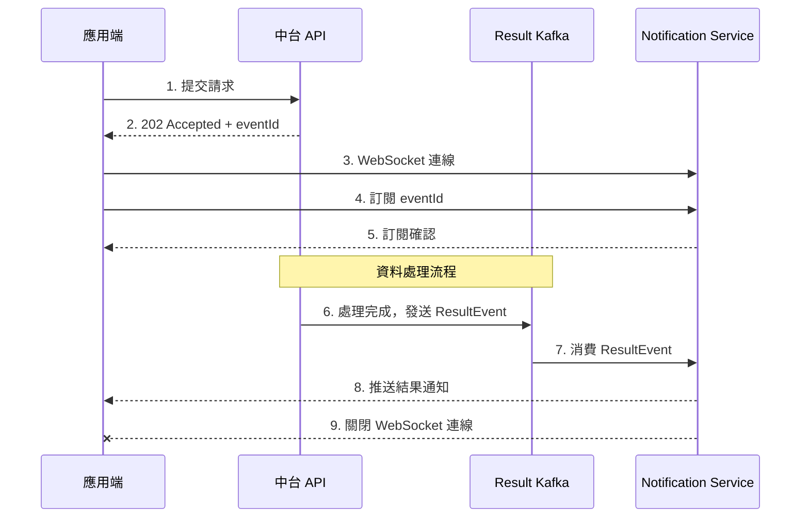
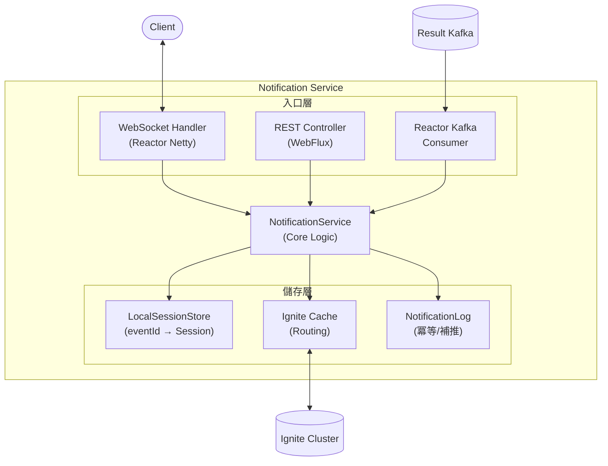
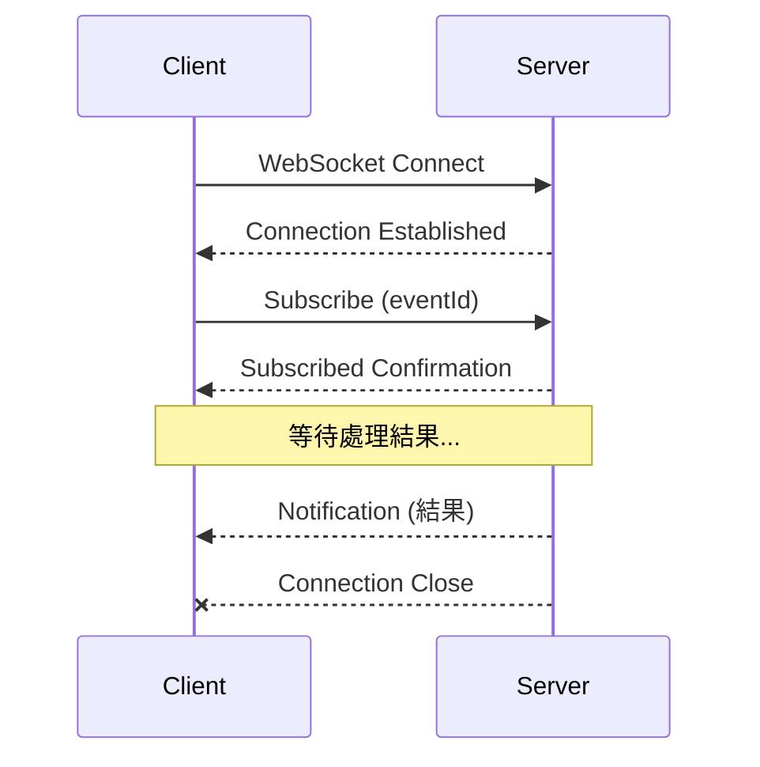

# Notification Service

[](https://openjdk.org/projects/jdk/21/)
[](https://spring.io/projects/spring-boot)
[]()

資料中台結果通知服務 — 基於 WebSocket 的非同步事件通知系統。

## 📋 目錄

- [概述](#概述)
- [系統架構](#系統架構)
- [技術棧](#技術棧)
- [快速開始](#快速開始)
- [配置說明](#配置說明)
- [API 文件](#api-文件)
- [WebSocket 協議](#websocket-協議)
- [狀態碼定義](#狀態碼定義)
- [測試](#測試)
- [專案結構](#專案結構)

## 概述

Notification Service 是資料中台架構中的**結果通知服務**，負責在資料處理完成後，透過 WebSocket **非同步通知**原始請求端處理結果（成功/失敗）。

### 核心功能

- 🔌 **WebSocket 連線管理** — 支援萬級同時連線
- 📨 **Kafka 訊息消費** — 接收處理結果事件
- 🔄 **跨節點通知** — 透過 Ignite 實現分散式路由
- ✅ **冪等性保證** — 避免重複推送通知
- 💓 **健康檢查** — 完整的服務健康指標

### 系統流程



## 系統架構



### 元件說明

| 元件 | 說明 |
|------|------|
| **WebSocket Handler** | 處理 WebSocket 連線、訂閱/取消訂閱請求 |
| **REST Controller** | 提供健康檢查 API |
| **Reactor Kafka Consumer** | 消費 Result Kafka 訊息 |
| **NotificationService** | 核心業務邏輯，處理通知推送 |
| **LocalSessionStore** | 本地 Session 儲存（eventId → WebSocket Session） |
| **Ignite Cache** | 分散式快取，儲存訂閱路由資訊 |
| **NotificationLog** | 通知日誌，確保冪等性 |

## 技術棧

| 項目 | 技術 | 版本 | 說明 |
|------|------|------|------|
| 語言 | Java | 21 | LTS 版本，支援 Virtual Threads |
| 框架 | Spring Boot + WebFlux | 3.2.1 | 非同步非阻塞，支援高併發 |
| WebSocket | Reactor Netty | - | WebFlux 原生支援 |
| Kafka | Reactor Kafka | 1.3.22 | 響應式 Kafka 客戶端 |
| 分散式快取 | Apache Ignite | 2.17.0 | 跨節點狀態共享 |
| 監控 | Micrometer + Prometheus | - | 指標收集 |
| 建置工具 | Maven | - | |

### 為何選擇 WebFlux

| 考量 | 說明 |
|------|------|
| **高併發需求** | 峰值 10,000 同時連線，傳統 Thread-per-request 無法應對 |
| **資源效率** | Event Loop 模型，~20 Threads 處理萬級連線 |
| **WebSocket 適配** | 長連線場景下不佔用 Thread |
| **記憶體效率** | 傳統模型需 10GB+ Thread stack，WebFlux 僅需 ~100MB |

## 快速開始

### 前置需求

- Java 21+
- Maven 3.8+
- Kafka (或使用模擬模式)
- Apache Ignite (或使用模擬模式)

### 建置專案

```bash
# 編譯
mvn clean package

# 跳過測試編譯
mvn clean package -DskipTests
```

### 執行服務

```bash
# 開發模式（使用模擬 Kafka 和 Ignite）
mvn spring-boot:run \
  -Dspring-boot.run.jvmArguments="--add-opens java.base/java.nio=ALL-UNNAMED"

# 或使用 JAR
java --add-opens java.base/java.nio=ALL-UNNAMED \
     --add-opens java.base/sun.nio.ch=ALL-UNNAMED \
     -jar target/notification-service-1.0.0-SNAPSHOT.jar
```

### 驗證服務

```bash
# 健康檢查
curl http://localhost:8080/api/health

# Readiness 檢查
curl http://localhost:8080/api/ready

# Actuator 端點
curl http://localhost:8080/actuator/health
```

## 配置說明

主要配置項位於 `application.properties`：

### 伺服器配置

```properties
server.port=8080
spring.application.name=notification-service
```

### Kafka 配置

```properties
spring.kafka.bootstrap-servers=skafka:9092
spring.kafka.consumer.group-id=notification-service
app.kafka.topic.notification-result=results
app.kafka.enabled=true                    # false 使用模擬模式
```

### Ignite 配置

```properties
app.ignite.enabled=true                   # false 使用模擬模式
app.ignite.addresses=localhost:10800
app.ignite.cluster-name=osw-cluster

# 訂閱路由快取
app.ignite.cache.subscription-routing.name=subscription-routing-v2
app.ignite.cache.subscription-routing.expiry-seconds=300

# 通知日誌快取
app.ignite.cache.notification-log.name=notification-logs
app.ignite.cache.notification-log.expiry-seconds=600
```

### WebSocket 配置

```properties
app.websocket.path=/ws/notifications
app.websocket.max-connections=10000
app.websocket.idle-timeout-seconds=60
```

### 業務邏輯配置

```properties
app.subscription.timeout-seconds=30       # 訂閱超時
app.notification.max-retries=3            # 推送重試次數
app.notification.retry-delay-ms=1000      # 重試間隔
```

## API 文件

### REST API

#### 健康檢查

```http
GET /api/health
```

回應範例：
```json
{
  "status": "UP",
  "kafka": "UP",
  "ignite": "UP",
  "websocket": {
    "connections": 150,
    "subscriptions": 120
  }
}
```

#### Readiness 檢查

```http
GET /api/ready
```

回應範例：
```json
{
  "ready": true,
  "checks": {
    "kafka": true,
    "ignite": true
  }
}
```

## WebSocket 協議

### 連線端點

```
ws://localhost:8080/ws/notifications
```

### 訊息格式

所有訊息均使用 JSON 格式，包含 `type` 欄位標識訊息類型。

#### 1. 訂閱請求 (Client → Server)

```json
{
  "type": "subscribe",
  "eventId": "evt-123456"
}
```

#### 2. 訂閱確認 (Server → Client)

```json
{
  "type": "subscribed",
  "eventId": "evt-123456",
  "timestamp": "2024-01-15T10:30:00Z"
}
```

#### 3. 取消訂閱 (Client → Server)

```json
{
  "type": "unsubscribe",
  "eventId": "evt-123456"
}
```

#### 4. 取消訂閱確認 (Server → Client)

```json
{
  "type": "unsubscribed",
  "eventId": "evt-123456"
}
```

#### 5. 結果通知 (Server → Client)

```json
{
  "type": "notification",
  "eventId": "evt-123456",
  "historyId": "hist-789",
  "status": 1000,
  "message": "處理完成",
  "payload": { ... },
  "timestamp": "2024-01-15T10:30:05Z"
}
```

#### 6. 心跳 Ping/Pong

```json
// Client → Server
{ "type": "ping" }

// Server → Client
{ "type": "pong", "timestamp": "2024-01-15T10:30:00Z" }
```

#### 7. 錯誤訊息 (Server → Client)

```json
{
  "type": "error",
  "code": "INVALID_FORMAT",
  "message": "Invalid message format"
}
```

### 連線生命週期



> **Note**: 收到終態通知（status ≥ 1000）後，伺服器會主動關閉 WebSocket 連線。

## 狀態碼定義

### 狀態碼分類

| 範圍 | 類型 | 說明 |
|------|------|------|
| 1xxx | 成功 | 處理成功 |
| 2xxx | 業務錯誤 | 業務邏輯錯誤 |
| 3xxx | 系統錯誤 | 系統層級錯誤 |

### 完整狀態碼表

| 狀態碼 | 名稱 | 說明 | Log Level |
|--------|------|------|-----------|
| **1000** | SUCCESS | 成功 | INFO |
| **1001** | PARTIAL_SUCCESS | 部分成功 | INFO |
| **1002** | ACCEPTED | 已接受處理 | INFO |
| **2000** | BIZ_ERROR | 業務錯誤（通用） | WARN |
| **2001** | NOT_FOUND | 資料不存在 | WARN |
| **2002** | VALIDATION_FAILED | 驗證失敗 | WARN |
| **2003** | PERMISSION_DENIED | 權限不足 | WARN |
| **2004** | DUPLICATE_REQUEST | 重複請求 | WARN |
| **3000** | SYS_ERROR | 系統錯誤（通用） | ERROR |
| **3001** | TIMEOUT | 處理超時 | ERROR |
| **3002** | SERVICE_UNAVAILABLE | 服務不可用 | ERROR |
| **3003** | INTERNAL_ERROR | 內部錯誤 | ERROR |

### 終態判斷

所有 **status ≥ 1000** 的狀態碼都是**終態**，表示處理已結束：
- 伺服器會在推送通知後主動關閉 WebSocket 連線
- 客戶端無需繼續等待

## 測試

### 單元測試

```bash
# 執行所有測試
mvn test

# 執行特定測試類別
mvn test -Dtest=NotificationServiceTest

# 顯示測試報告
mvn test -Dsurefire.useFile=false
```

### 測試覆蓋範圍

| 測試類別 | 涵蓋範圍 |
|---------|---------|
| `NotificationServiceTest` | 核心通知邏輯、冪等性、跨節點路由 |
| `LocalSessionStoreTest` | WebSocket Session 管理、併發安全 |
| `SimulatedIgniteCacheTest` | Ignite 快取操作 |
| `StatusCodeTest` | 狀態碼判斷邏輯 |
| `ResultEventTest` | Kafka 事件模型 |
| `WebSocketMessagesTest` | WebSocket 訊息序列化 |
| `HealthIndicatorsTest` | 健康檢查指標 |
| `NotificationControllerTest` | REST API 端點 |
| `KafkaConsumerTest` | Kafka 訊息解析 |

### E2E 測試

使用 `scripts/` 目錄下的腳本進行端對端測試：

```bash
# 前置：安裝工具
brew install kcat websocat jq

# 執行 E2E 測試
./scripts/e2e-test.sh

# 詳細輸出
./scripts/e2e-test.sh --verbose

# 執行所有測試案例
./scripts/e2e-test.sh --all --verbose
```

詳細說明請參考 [scripts/README.md](scripts/README.md)。

## 專案結構

```
NotificationService/
├── pom.xml                          # Maven 配置
├── README.md                        # 專案說明（本文件）
├── spec.md                          # MVP 規格書
├── spec_v2.md                       # v2 規格書
│
├── scripts/                         # 測試腳本
│   ├── e2e-test.sh                  # E2E 自動化測試
│   ├── kafka-send.sh                # 發送 Kafka 訊息
│   ├── ws-listen.sh                 # WebSocket 監聽
│   ├── test-notification.sh         # 通知測試
│   └── README.md                    # 腳本說明
│
└── src/
    ├── main/
    │   ├── java/com/osw/dmp/ns/
    │   │   ├── NotificationServiceApplication.java   # 啟動類別
    │   │   │
    │   │   ├── config/              # 配置類別
    │   │   │   ├── IgniteConfig.java
    │   │   │   ├── JacksonConfig.java
    │   │   │   ├── KafkaConfig.java
    │   │   │   └── WebSocketConfig.java
    │   │   │
    │   │   ├── controller/          # REST 控制器
    │   │   │   └── NotificationController.java
    │   │   │
    │   │   ├── health/              # 健康檢查
    │   │   │   └── HealthIndicators.java
    │   │   │
    │   │   ├── ignite/              # Ignite 快取
    │   │   │   ├── IgniteCacheService.java          # 介面
    │   │   │   ├── RealIgniteCacheService.java      # 真實實作
    │   │   │   └── SimulatedIgniteCache.java        # 模擬實作
    │   │   │
    │   │   ├── kafka/               # Kafka 消費者
    │   │   │   ├── KafkaConsumerStatus.java         # 狀態介面
    │   │   │   ├── ReactorKafkaConsumer.java        # 真實消費者
    │   │   │   └── SimulatedKafkaConsumer.java      # 模擬消費者
    │   │   │
    │   │   ├── model/               # 資料模型
    │   │   │   ├── NotificationLog.java
    │   │   │   ├── ResultEvent.java
    │   │   │   ├── ResultPayload.java
    │   │   │   ├── StatusCode.java
    │   │   │   └── SubscriptionRouting.java
    │   │   │
    │   │   ├── service/             # 核心服務
    │   │   │   └── NotificationService.java
    │   │   │
    │   │   └── websocket/           # WebSocket 處理
    │   │       ├── LocalSessionStore.java
    │   │       ├── NotificationWebSocketHandler.java
    │   │       └── WebSocketMessages.java
    │   │
    │   └── resources/
    │       ├── application.properties    # 主配置檔
    │       └── static/
    │           └── test.html             # 測試頁面
    │
    └── test/                        # 單元測試
        └── java/com/osw/dmp/ns/
            ├── service/
            ├── websocket/
            ├── ignite/
            ├── kafka/
            ├── model/
            ├── health/
            └── controller/
```

## 容量規格

| 指標 | 規格 |
|------|------|
| 每秒新連線數 | 1,000 |
| 連線持續時間 | 5-10 秒 |
| 峰值同時連線 | 5,000 - 10,000 |
| 每秒處理量 | 1,000 TPS |

## 授權

Proprietary - All rights reserved.

---

**Notification Service** © 2024 OSW Data Platform
