# NS 節點間通訊協議 (NS Inter-Node Protocol)

> **實作狀態**: ✅ 已完成 (2026-01-13)
> **測試狀態**: ✅ 195 tests passed

## 1. 概述

本文件定義 Notification Service (NS) 節點之間的通訊協議，用於解決跨節點推送問題。

### 1.1 問題背景

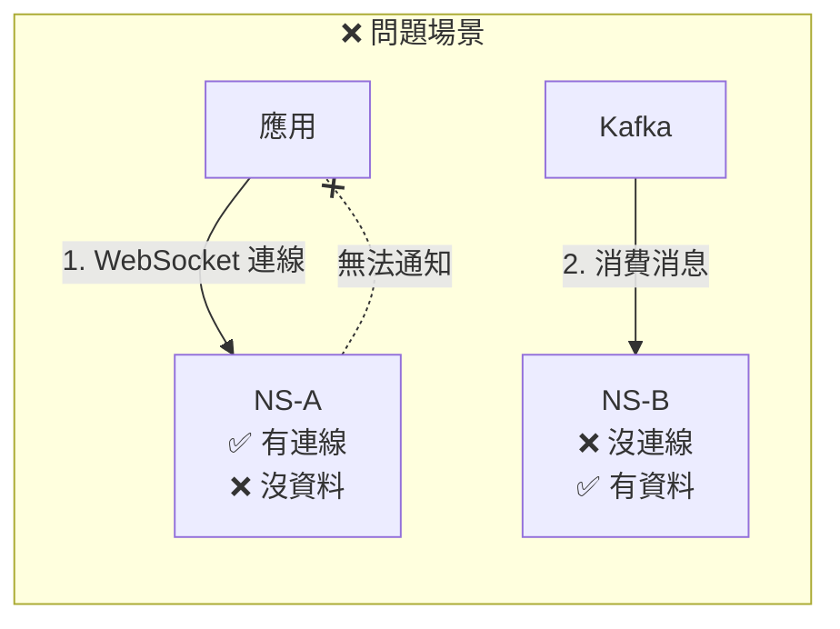

**問題**：
1. 應用連線到 NS-A，訂閱 eventId=X
2. Kafka 消息被 NS-B 消費（Consumer Group 隨機分配）
3. NS-B 有資料，但沒有連線
4. NS-A 有連線，但沒有資料
5. **結果：應用收不到即時通知 ❌**

### 1.2 解決方案

NS 節點之間透過 **gRPC** 直接通訊，實現跨節點推送。

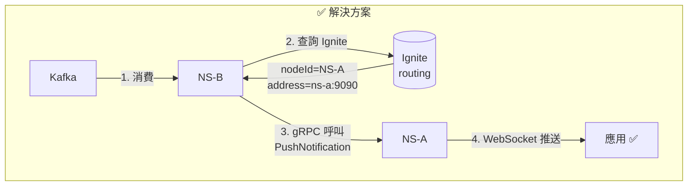

---

## 2. 架構設計

### 2.1 整體架構

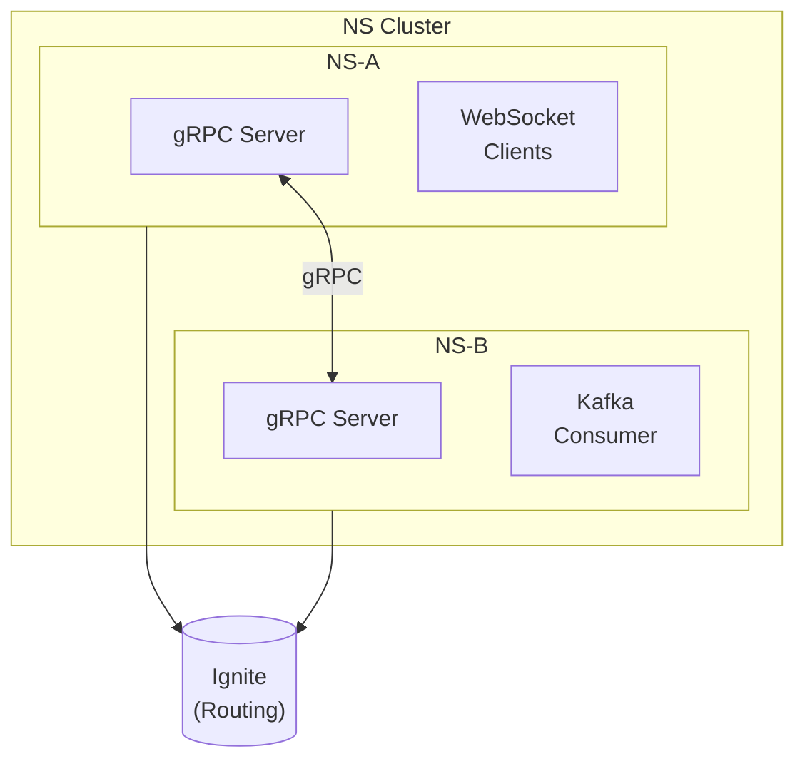

### 2.2 節點身份識別

每個 NS 節點需要有唯一識別：

| 屬性 | 說明 | 範例 |
|------|------|------|
| `nodeId` | 節點唯一 ID | `ns-a-1`, `ns-b-2` |
| `grpcAddress` | gRPC 服務地址 | `ns-a.internal:9090` |
| `startedAt` | 啟動時間 | epoch millis |

**nodeId 生成策略**：
```
{hostname}-{port}-{startupTimestamp}
或
{POD_NAME} (Kubernetes 環境)
```

---

## 3. 資料模型

### 3.1 SubscriptionRouting（擴展）

```java
public class SubscriptionRouting {
    String eventId;           // 事件識別碼
    String nodeId;            // 節點 ID
    String grpcAddress;       // 節點 gRPC 地址（新增）
    String sessionId;         // WebSocket Session ID
    long subscribedAtMillis;  // 訂閱時間
}
```

### 3.2 NodeRegistry（新增）✅

節點註冊表，用於追蹤叢集中的所有節點。

```java
@Data
@Builder
public class NodeInfo {
    String nodeId;            // 節點 ID
    String grpcAddress;       // gRPC 地址
    long startedAtMillis;     // 啟動時間
    long lastHeartbeatMillis; // 最後心跳時間
    NodeStatus status;        // 節點狀態
    int activeConnections;    // 活躍連線數
    int activeSubscriptions;  // 活躍訂閱數
    
    public boolean isOnline() {
        return status == NodeStatus.ONLINE;
    }
    
    public boolean isAvailableForPush() {
        return status == NodeStatus.ONLINE || status == NodeStatus.SUSPECTED;
    }
}

public enum NodeStatus {
    ONLINE,      // 正常運作
    SUSPECTED,   // 疑似離線（心跳超時）
    OFFLINE      // 已確認離線
}
```

**Ignite Cache**：`ns-nodes`
**Key**：`nodeId`
**TTL**：無（透過心跳機制管理）

### 3.3 節點發現機制 ✅

節點透過 **共享的 Ignite Cache** 互相發現：

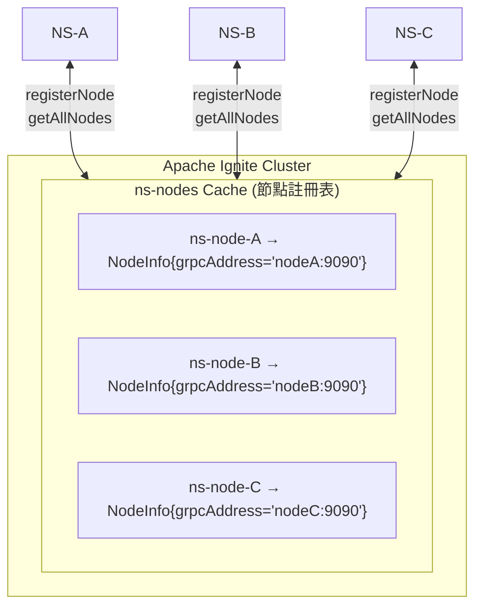

**IgniteCacheService 介面（節點相關）**：
```java
public interface IgniteCacheService {
    // Node Registry Operations
    void registerNode(NodeInfo nodeInfo);
    void unregisterNode(String nodeId);
    Optional<NodeInfo> getNode(String nodeId);
    Collection<NodeInfo> getAllNodes();
    void updateNodeHeartbeat(String nodeId);
    void removeRoutingsByNodeId(String nodeId);
}
```

---

## 4. gRPC 協議定義

### 4.1 Protocol Buffers

```protobuf
syntax = "proto3";

package ns.protocol;

option java_package = "com.osw.dmp.ns.grpc";
option java_outer_classname = "NsProtocol";

// ============================================
// 節點間通訊服務
// ============================================
service NodeService {
    // 跨節點推送通知
    rpc PushNotification(PushRequest) returns (PushResponse);
    
    // 心跳檢查
    rpc Heartbeat(HeartbeatRequest) returns (HeartbeatResponse);
    
    // 查詢節點狀態
    rpc GetNodeStatus(NodeStatusRequest) returns (NodeStatusResponse);
}

// ============================================
// 推送通知
// ============================================
message PushRequest {
    string event_id = 1;           // 事件 ID
    string session_id = 2;         // 目標 Session ID
    int32 status = 3;              // 業務狀態碼
    string message = 4;            // 訊息內容
    int64 timestamp = 5;           // 時間戳
    string source_node_id = 6;     // 來源節點 ID（用於追蹤）
    string trace_id = 7;           // 追蹤 ID
}

message PushResponse {
    bool success = 1;              // 是否成功
    PushResultCode code = 2;       // 結果碼
    string message = 3;            // 訊息（失敗原因）
}

enum PushResultCode {
    PUSH_SUCCESS = 0;              // 推送成功
    SESSION_NOT_FOUND = 1;         // Session 不存在
    SESSION_CLOSED = 2;            // Session 已關閉
    SEND_FAILED = 3;               // 發送失敗
    INTERNAL_ERROR = 4;            // 內部錯誤
}

// ============================================
// 心跳
// ============================================
message HeartbeatRequest {
    string node_id = 1;            // 節點 ID
    int64 timestamp = 2;           // 時間戳
}

message HeartbeatResponse {
    bool alive = 1;                // 是否存活
    int64 timestamp = 2;           // 回應時間戳
}

// ============================================
// 節點狀態
// ============================================
message NodeStatusRequest {
    string node_id = 1;            // 要查詢的節點 ID（空則查自己）
}

message NodeStatusResponse {
    string node_id = 1;
    string grpc_address = 2;
    int64 started_at = 3;
    int32 active_connections = 4;  // 活躍連線數
    int32 active_subscriptions = 5; // 活躍訂閱數
}
```

### 4.2 gRPC 服務端點

| 方法 | 用途 | 說明 |
|------|------|------|
| `PushNotification` | 跨節點推送 | NS-B 呼叫 NS-A 推送通知 |
| `Heartbeat` | 心跳檢測 | 確認節點存活 |
| `GetNodeStatus` | 狀態查詢 | 取得節點運作狀態 |

---

## 5. 核心流程

### 5.1 節點啟動流程

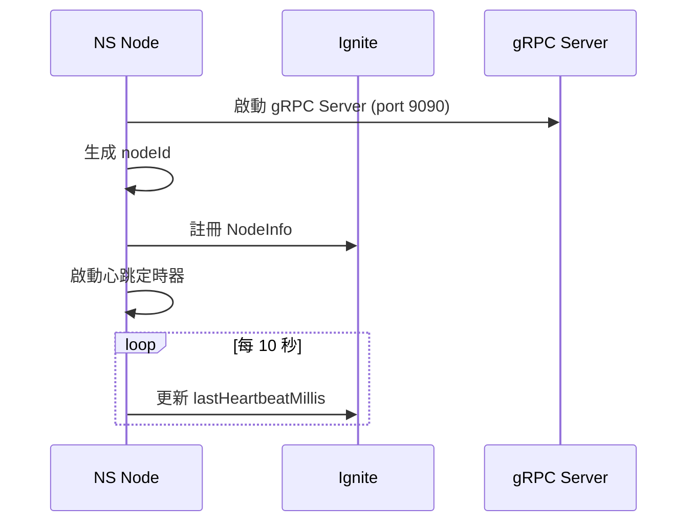

### 5.2 訂閱流程（擴展）

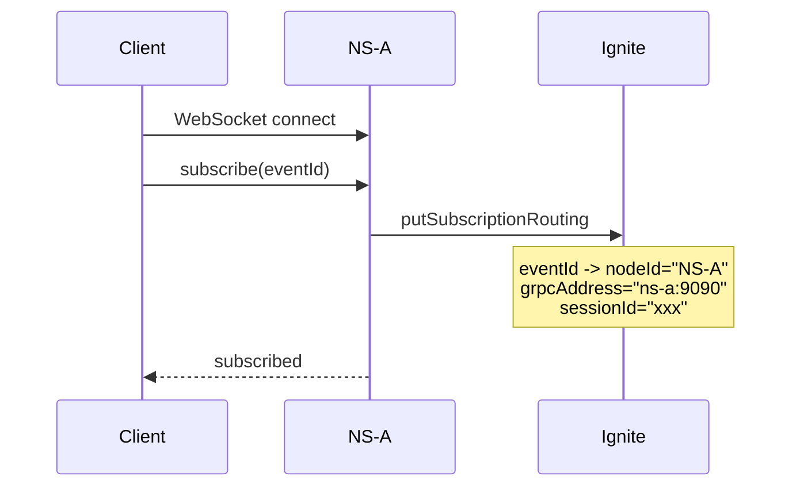

### 5.3 跨節點推送流程

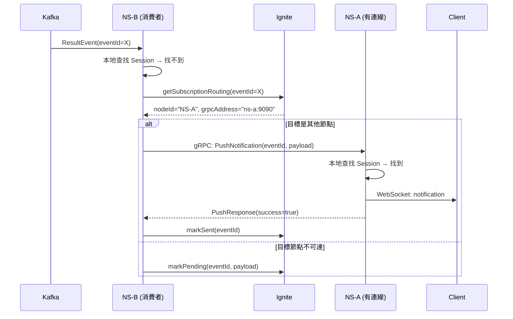

### 5.4 推送失敗處理

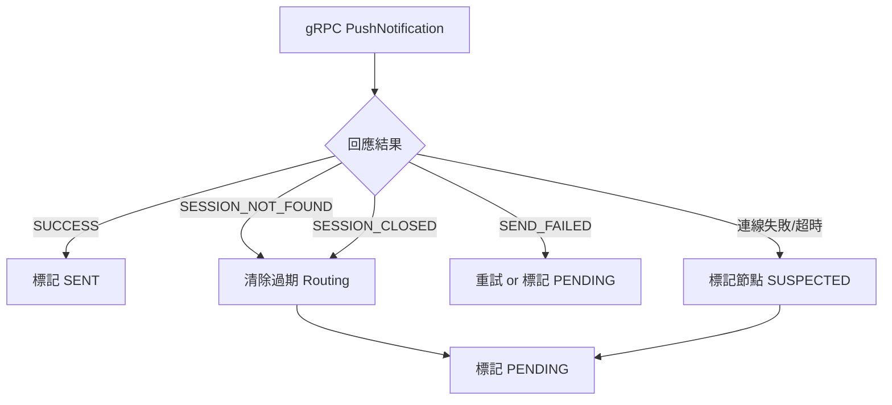

---

## 6. 節點健康管理

### 6.1 心跳機制

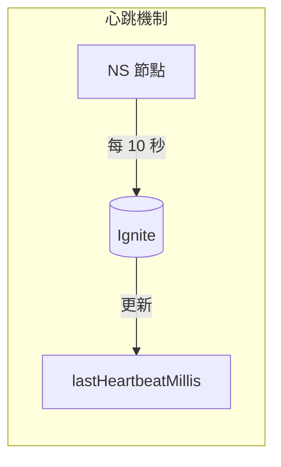

| 參數 | 預設值 | 設定 | 說明 |
|------|--------|------|------|
| 心跳間隔 | 5 秒 | `app.node.heartbeat.interval-ms=5000` | 定期更新 Ignite |
| 超時判定 | 10 秒 | `app.node.heartbeat.timeout-ms=10000` | 無心跳 → SUSPECTED |
| 離線判定 | 30 秒 | `app.node.heartbeat.offline-ms=30000` | 無心跳 → OFFLINE |

**節點離線時**：
- 清除該節點的所有 SubscriptionRouting
- 相關 eventId 的訂閱者需重新連線

### 6.2 節點狀態轉換

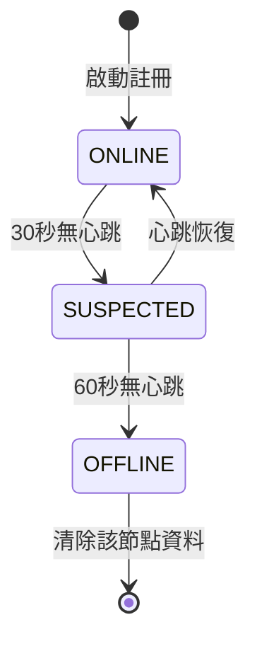

---

## 7. 設定參數

### 7.1 application.properties

```properties
# ============================================
# NS 節點間通訊設定
# ============================================

# gRPC Server
app.grpc.enabled=true
app.grpc.port=9090

# Node Identity (auto-generated if not set)
app.node.id=${HOSTNAME:localhost}-${server.port:8080}

# Heartbeat
app.node.heartbeat.interval-ms=5000
app.node.heartbeat.timeout-ms=10000
app.node.heartbeat.offline-ms=30000

# gRPC Client
app.grpc.client.timeout-ms=5000
app.grpc.client.retry-count=2
app.grpc.client.retry-delay-ms=500

# Ignite Cache - Node Registry
app.ignite.cache.node-registry.name=ns-nodes
app.ignite.cache.node-registry.backups=2
```

### 7.2 環境變數（Kubernetes）

```yaml
env:
  - name: HOSTNAME
    valueFrom:
      fieldRef:
        fieldPath: metadata.name
  - name: POD_IP
    valueFrom:
      fieldRef:
        fieldPath: status.podIP
  - name: APP_NODE_ID
    value: "$(HOSTNAME)"
  - name: APP_GRPC_ADDRESS
    value: "$(POD_IP):9090"
```

---

## 8. 實作元件

### 8.1 元件清單

| 元件 | 類別 | 檔案路徑 | 狀態 |
|------|------|----------|------|
| `NodeIdentity` | Service | `grpc/NodeIdentity.java` | ✅ |
| `NodeRegistry` | Service | `grpc/NodeRegistry.java` | ✅ |
| `GrpcServerConfig` | Config | `grpc/GrpcServerConfig.java` | ✅ |
| `GrpcClientManager` | Infrastructure | `grpc/GrpcClientManager.java` | ✅ |
| `NodeServiceImpl` | gRPC Service | `grpc/NodeServiceImpl.java` | ✅ |
| `CrossNodePushService` | Service | `grpc/CrossNodePushService.java` | ✅ |
| `GrpcProperties` | Config | `config/GrpcProperties.java` | ✅ |
| `NodeProperties` | Config | `config/NodeProperties.java` | ✅ |
| `NodeInfo` | Model | `model/NodeInfo.java` | ✅ |
| `NodeStatus` | Model | `model/NodeStatus.java` | ✅ |

### 8.2 類別關係

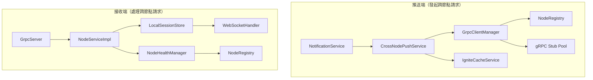

---

## 9. 錯誤處理

### 9.1 錯誤場景與處理

| 場景 | 處理方式 |
|------|----------|
| gRPC 連線失敗 | 重試 2 次，失敗後標記 PENDING |
| gRPC 超時 | 標記目標節點 SUSPECTED，標記 PENDING |
| SESSION_NOT_FOUND | 清除過期 Routing，標記 PENDING |
| 目標節點 OFFLINE | 清除 Routing，標記 PENDING |

### 9.2 降級策略

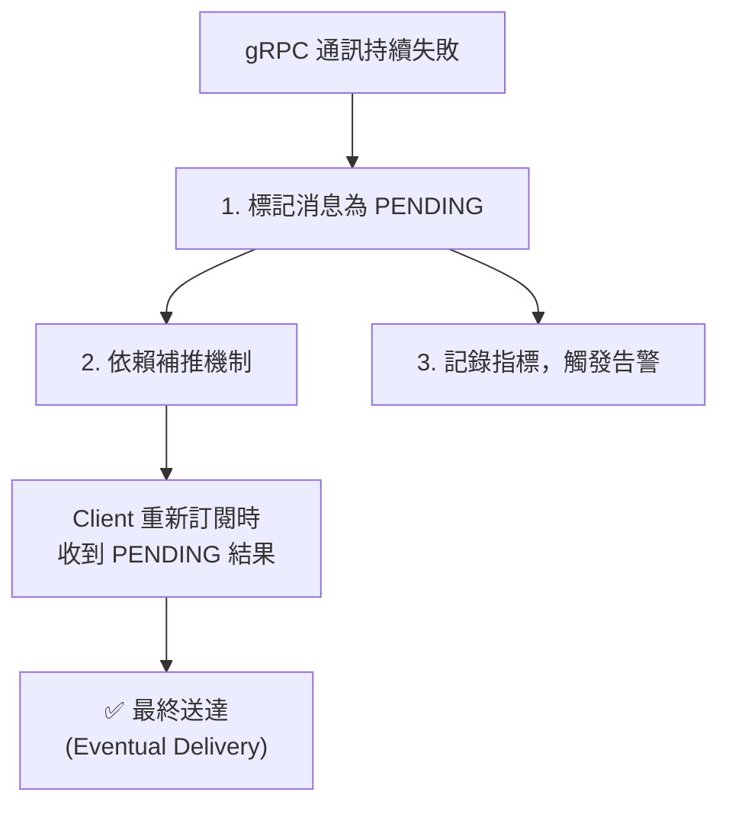

> 這確保系統在跨節點通訊故障時仍能最終送達（eventual delivery）

---

## 10. 監控指標

### 10.1 新增 Metrics

```java
// 跨節點推送
ns_cross_node_push_total{target_node, result}     // 跨節點推送次數
ns_cross_node_push_duration_seconds{target_node}  // 推送延遲

// gRPC 通訊
ns_grpc_requests_total{method, status}            // gRPC 請求數
ns_grpc_request_duration_seconds{method}          // gRPC 延遲

// 節點健康
ns_node_status{node_id, status}                   // 節點狀態
ns_node_last_heartbeat_seconds{node_id}           // 最後心跳距今秒數
ns_cluster_node_count{status}                     // 各狀態節點數
```

### 10.2 告警規則

```yaml
groups:
  - name: ns-cluster
    rules:
      - alert: NSNodeDown
        expr: ns_node_status{status="OFFLINE"} > 0
        for: 1m
        labels:
          severity: warning
        annotations:
          summary: "NS 節點離線: {{ $labels.node_id }}"

      - alert: NSCrossNodePushFailureHigh
        expr: rate(ns_cross_node_push_total{result="FAILED"}[5m]) > 0.1
        for: 5m
        labels:
          severity: critical
        annotations:
          summary: "跨節點推送失敗率過高"
```

---

## 11. 部署考量

### 11.1 網路需求

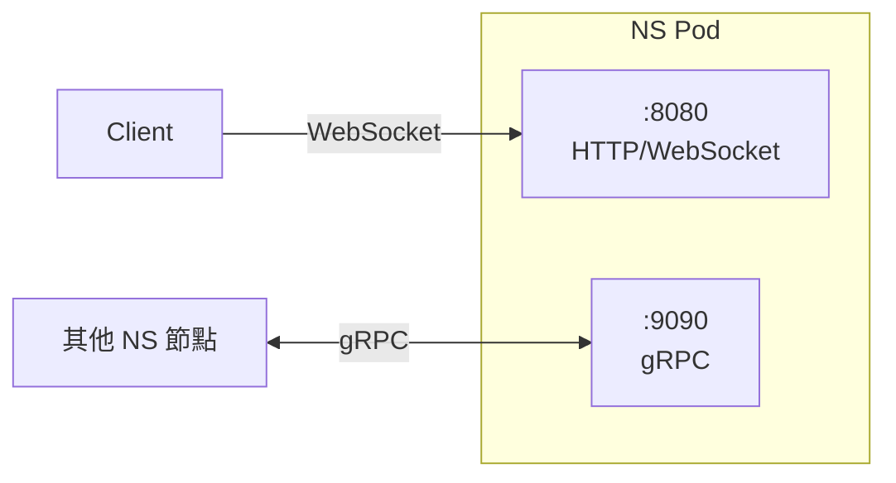

| Port | 協議 | 用途 |
|------|------|------|
| 8080/tcp | HTTP/WebSocket | Client 連線 |
| 9090/tcp | gRPC | 節點間通訊 |

**Kubernetes 服務發現**：
- 使用 Headless Service 讓 Pod 互相發現
- 或透過 Ignite 中的 NodeRegistry 取得其他節點地址

### 11.2 Kubernetes Service 範例

```yaml
# Headless Service for inter-node communication
apiVersion: v1
kind: Service
metadata:
  name: ns-headless
spec:
  clusterIP: None
  selector:
    app: notification-service
  ports:
    - name: grpc
      port: 9090
      targetPort: 9090

---
# Regular Service for client access
apiVersion: v1
kind: Service
metadata:
  name: ns-service
spec:
  selector:
    app: notification-service
  ports:
    - name: http
      port: 8080
      targetPort: 8080
```

---

## 12. 實作優先序

### Phase 1：基礎建設 ✅ 完成
1. ✅ 定義 Protocol Buffers (`src/main/proto/ns_protocol.proto`)
2. ✅ 實作 gRPC Server/Client (`GrpcServerConfig`, `GrpcClientManager`)
3. ✅ 擴展 SubscriptionRouting 加入 grpcAddress

### Phase 2：核心邏輯 ✅ 完成
4. ✅ 實作 CrossNodePushService
5. ✅ 整合到 NotificationService
6. ✅ 實作失敗重試與 PENDING 降級

### Phase 3：健康管理 ✅ 完成
7. ✅ 實作 NodeRegistry（整合 Ignite Cache）
8. ✅ 實作心跳機制（ScheduledExecutorService）
9. ✅ 實作節點狀態轉換（ONLINE → SUSPECTED → OFFLINE）

### Phase 4：監控與維運 ⏳ 待實作
10. ⏳ 加入 Metrics
11. ⏳ 設定告警規則
12. ✅ 文件與測試（195 tests passed）

---

## 13. 附錄：與現有架構的差異

| 項目 | 現有 | 新增 |
|------|------|------|
| 節點通訊 | 無 | gRPC |
| 服務發現 | 無 | Ignite NodeRegistry (`ns-nodes` cache) |
| Routing 資訊 | nodeId, sessionId | + grpcAddress |
| 跨節點推送 | 標記 PENDING | 先嘗試 gRPC，失敗才 PENDING |
| 健康檢查 | 無 | 心跳機制 |

---

## 14. 實作檔案清單

### 新增檔案

```
src/main/
├── proto/
│   └── ns_protocol.proto          # gRPC Protocol Buffers 定義
├── java/com/osw/dmp/ns/
│   ├── config/
│   │   ├── GrpcProperties.java    # gRPC 設定屬性
│   │   └── NodeProperties.java    # 節點設定屬性
│   ├── grpc/
│   │   ├── NodeIdentity.java      # 節點身份管理
│   │   ├── NodeRegistry.java      # 節點註冊表（使用 Ignite）
│   │   ├── GrpcServerConfig.java  # gRPC Server 設定
│   │   ├── GrpcClientManager.java # gRPC Client 連線管理
│   │   ├── NodeServiceImpl.java   # gRPC 服務實作
│   │   └── CrossNodePushService.java # 跨節點推送服務
│   └── model/
│       ├── NodeInfo.java          # 節點資訊模型
│       └── NodeStatus.java        # 節點狀態列舉
```

### 修改檔案

| 檔案 | 修改內容 |
|------|----------|
| `pom.xml` | 加入 gRPC/Protobuf 依賴 |
| `SubscriptionRouting.java` | 加入 `grpcAddress` 欄位 |
| `IgniteCacheService.java` | 加入節點註冊介面方法 |
| `SimulatedIgniteCache.java` | 實作節點註冊方法 |
| `RealIgniteCacheService.java` | 實作節點註冊方法 |
| `NotificationService.java` | 整合 CrossNodePushService |
| `NotificationWebSocketHandler.java` | 使用 NodeIdentity |
| `application.properties` | 加入 gRPC/Node 設定 |
