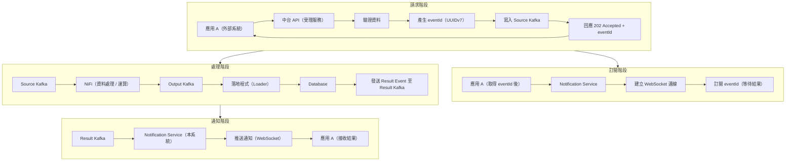
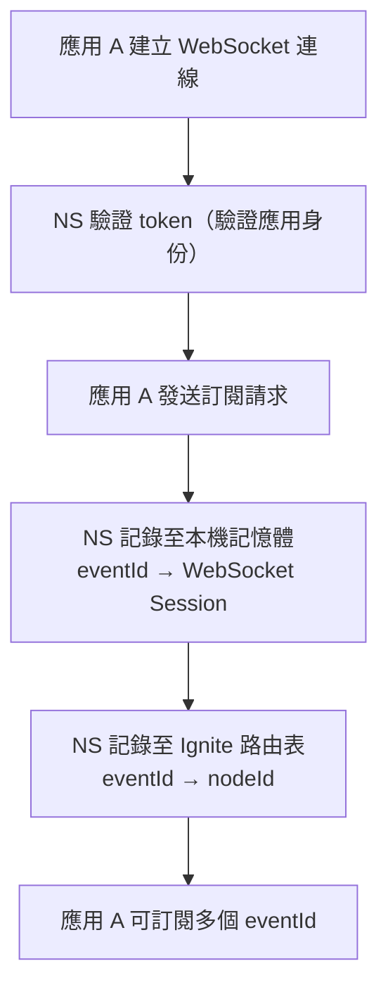
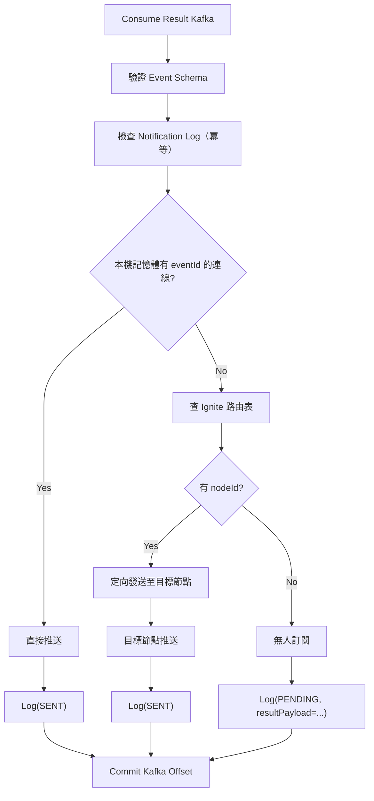
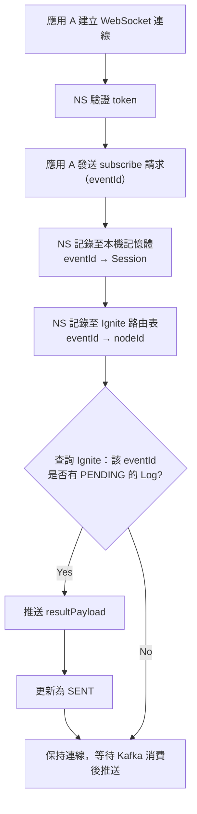
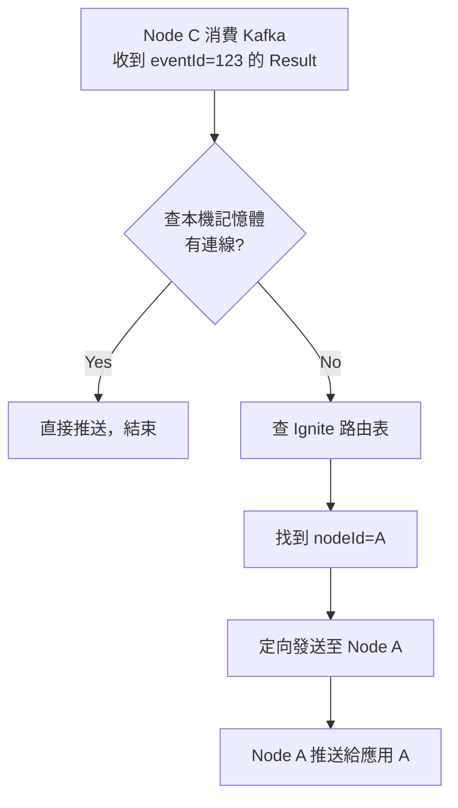
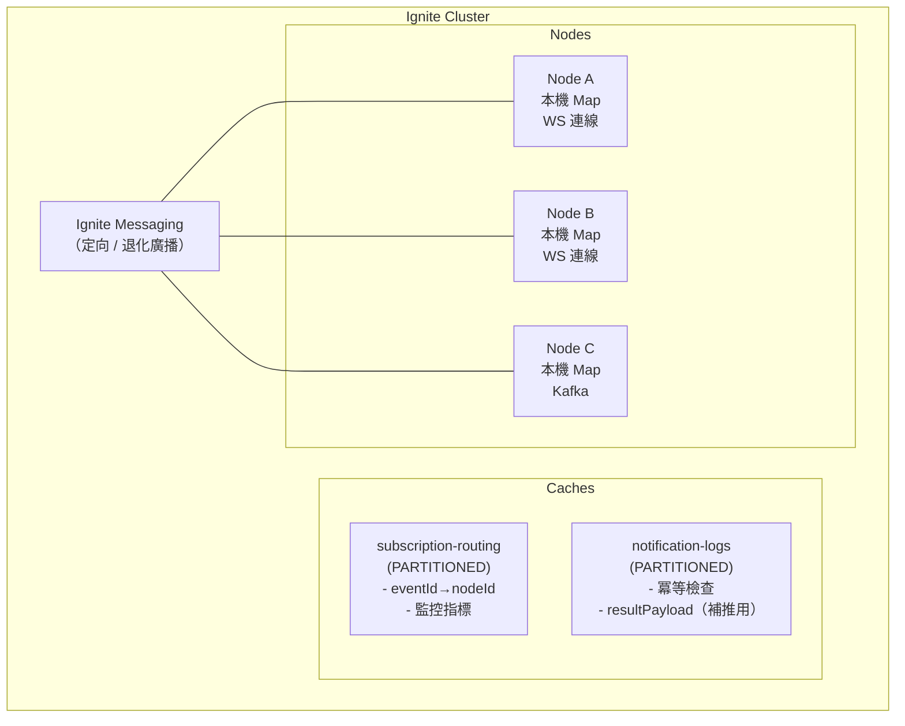
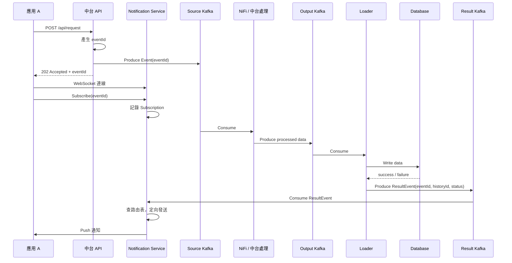

# Notification Service（MVP）規格書

## 1. 文件目的

本文件定義「Notification Service（結果通知服務）」之**最小可行版本（MVP）**規格，用於在事件驅動資料中台架構中，於資料最終寫入資料庫後，**非同步通知原始請求使用者處理結果（成功 / 失敗）**。

本規格可直接作為：

- 開發依據
- 架構審查文件
- 與應用層、中台層之責任切割說明

---

## 2. 系統背景與前提

### 2.1 整體流程（摘要）



### 2.2 核心設計原則

- 請求與結果 **完全非同步**
- 中台透過 **Notification Service** 與應用互動
- 結果本身也是一種「事件」
- 使用 `eventId` 作為端到端追蹤錨點

### 2.3 系統角色定義

| 角色 | 說明 |
|------|------|
| **應用 A** | 外部系統，呼叫中台、訂閱 eventId、接收結果 |
| **中台 API** | 中台入口服務，受理請求、產生 EventId |
| **Notification Service** | 中台結果服務，管理 Subscription、消費 Result Kafka、推送通知 |

### 2.4 容量規格

| 指標 | 規格 |
|------|------|
| 每秒新連線數 | 1,000 |
| 連線持續時間 | 5-10 秒 |
| 峰值同時連線 | 5,000 - 10,000 |
| 每秒處理量 | 1,000 TPS |

---

## 3. 技術選型

### 3.1 技術棧總覽

| 項目 | 選擇 | 說明 |
|------|------|------|
| 語言 | Java 21 | LTS 版本，支援 Virtual Threads |
| 框架 | Spring Boot 3.x + WebFlux | 非同步非阻塞，支援高併發 |
| WebSocket | Reactor Netty | WebFlux 原生支援 |
| Kafka Client | Reactor Kafka | 與 WebFlux 整合 |
| 分散式狀態儲存 | Apache Ignite | 中台已有基礎設施 |
| 建置工具 | Maven / Gradle | |
| 容器化 | Docker | |
| 部署環境 | Kubernetes | |

### 3.2 為何選擇 WebFlux

| 考量 | 說明 |
|------|------|
| 高併發需求 | 峰值 10,000 同時連線，傳統 MVC Thread-per-request 無法應對 |
| 資源效率 | WebFlux 使用 Event Loop，~20 Threads 處理萬級連線 |
| WebSocket | 需維持長連線 5-10 秒，WebFlux 不佔用 Thread |
| 記憶體 | 傳統模型需 10GB+ Thread stack，WebFlux 僅需 ~100MB |

### 3.3 架構圖

```
┌─────────────────────────────────────────────────────────┐
│                 Notification Service                     │
├─────────────────────────────────────────────────────────┤
│  ┌─────────────┐  ┌─────────────┐  ┌─────────────────┐  │
│  │   Reactor   │  │   WebFlux   │  │  Reactor Kafka  │  │
│  │   Netty     │  │  運維 API   │  │    Consumer     │  │
│  │  WebSocket  │  │             │  │                 │  │
│  └──────┬──────┘  └──────┬──────┘  └────────┬────────┘  │
│         │                │                   │          │
│         └────────────────┼───────────────────┘          │
│                          │                              │
│                   ┌──────▼──────┐                       │
│                   │   Service   │                       │
│                   │    Layer    │                       │
│                   └──────┬──────┘                       │
│                          │                              │
│                   ┌──────▼──────┐                       │
│                   │   Apache    │                       │
│                   │   Ignite    │                       │
│                   │  (狀態儲存)  │                       │
│                   └─────────────┘                       │
│                          │                              │
│              ┌────────────────┼─────────────────┐             │
│              │                │                 │             │
│              ▼                ▼                 ▼             │
│  ┌──────────────────┐  ┌────────────────────────────┐     │
│  │   Subscription   │  │      Notification Log      │     │
│  │     Routing      │  │    (冪等 + 補推 payload)   │     │
│  └──────────────────┘  └────────────────────────────┘     │
└─────────────────────────────────────────────────────────────┘
```

### 3.4 依賴清單

```xml
<!-- Spring Boot WebFlux -->
<dependency>
    <groupId>org.springframework.boot</groupId>
    <artifactId>spring-boot-starter-webflux</artifactId>
</dependency>

<!-- Reactor Kafka -->
<dependency>
    <groupId>io.projectreactor.kafka</groupId>
    <artifactId>reactor-kafka</artifactId>
</dependency>

<!-- Apache Ignite -->
<dependency>
    <groupId>org.apache.ignite</groupId>
    <artifactId>ignite-core</artifactId>
</dependency>
<dependency>
    <groupId>org.apache.ignite</groupId>
    <artifactId>ignite-spring</artifactId>
</dependency>

<!-- 其他 -->
<dependency>
    <groupId>org.projectlombok</groupId>
    <artifactId>lombok</artifactId>
</dependency>
```

---

## 4. Notification Service 定位與責任

### 4.1 服務定位

Notification Service 屬於 **中台元件**，責任為：

> **將中台產生的「處理結果事件」，透過 WebSocket 即時推送至訂閱的應用。**

### 4.2 明確責任

#### 必須負責

- 監聽 Result Kafka
- 解析處理結果事件
- 管理 Subscription（eventId → 連線）
- 執行通知派送（WebSocket）
- 確保冪等（避免重複通知）
- 記錄通知結果狀態

#### 明確不負責

- 不重新運算資料
- 不修改業務資料
- 不觸碰 NiFi / Source Kafka / Output Kafka
- 不決定資料成功與否（僅轉述結果）

---

## 5. 功能範圍

### 5.1 支援功能

- 單一通知通道：**WebSocket**
- 單一 Result Kafka Topic
- 基本成功 / 失敗通知
- 基本冪等控制
- 基本重試機制（最多 3 次，間隔 1 秒）

---

## 5A. WebSocket 連線管理規範

### 5A.1 連線建立

| 項目 | 規範 |
|------|------|
| Endpoint | `ws://host/ws/notifications` |
| 認證方式 | Bearer Token（JWT）於連線建立時驗證 |
| 連線識別 | 以 sessionId 為主鍵 |

### 5A.2 連線維護

| 項目 | 規範 |
|------|------|
| 心跳機制 | 每 30 秒發送 ping，10 秒內無 pong 則斷線 |
| 連線逾時 | 最大閒置時間 5 分鐘 |
| 單一使用者連線上限 | 5 條（超過時踢掉最舊連線） |
| 單節點總連線上限 | 10,000 條（依資源調整） |

### 5A.3 斷線處理

| 情境 | 處理方式 |
|------|----------|
| Client 主動斷線 | 清除連線狀態，不重試通知 |
| 網路異常斷線 | 等待重連，Subscription 仍有效至 expiresAt |
| 使用者離線時有通知 | 記錄 Notification Log 為 PENDING，不主動重送（MVP） |

### 5A.4 重連機制（Client 端建議）

```
初次重連延遲：1 秒
最大重連延遲：30 秒
退避策略：指數退避（1s → 2s → 4s → ... → 30s）
最大重試次數：無限制（由 Client 決定放棄時機）
```

---

## 5B. WebSocket 訊息協議

### 5B.1 訊息格式總覽

所有 WebSocket 訊息皆為 JSON 格式，包含 `type` 欄位標示訊息類型。

| 方向 | type | 說明 |
|------|------|------|
| Client → Server | `subscribe` | 訂閱 eventId |
| Client → Server | `unsubscribe` | 取消訂閱 |
| Client → Server | `ping` | 心跳 |
| Server → Client | `subscribed` | 訂閱成功 |
| Server → Client | `unsubscribed` | 取消訂閱成功 |
| Server → Client | `notification` | 推送結果通知 |
| Server → Client | `pong` | 心跳回應 |
| Server → Client | `error` | 錯誤訊息 |

---

### 5B.2 Client → Server 訊息

#### 訂閱請求

```json
{
  "type": "subscribe",
  "eventId": "uuidv7"
}
```

#### 取消訂閱

```json
{
  "type": "unsubscribe",
  "eventId": "uuidv7"
}
```

#### 心跳

```json
{
  "type": "ping",
  "timestamp": "ISO-8601 datetime"
}
```

---

### 5B.3 Server → Client 訊息

#### 訂閱成功

```json
{
  "type": "subscribed",
  "eventId": "uuidv7",
  "timestamp": "ISO-8601 datetime"
}
```

#### 結果通知（核心）

```json
{
  "type": "notification",
  "eventId": "uuidv7",
  "historyId": "uuidv7",
  "status": "SUCCESS | FAILED",
  "errorCode": "string | null",
  "errorMessage": "string | null",
  "completedAt": "ISO-8601 datetime",
  "timestamp": "ISO-8601 datetime"
}
```

#### 心跳回應

```json
{
  "type": "pong",
  "timestamp": "ISO-8601 datetime"
}
```

#### 錯誤訊息

```json
{
  "type": "error",
  "code": "INVALID_EVENT_ID | SUBSCRIPTION_LIMIT_EXCEEDED | INTERNAL_ERROR",
  "message": "錯誤說明",
  "eventId": "uuidv7 | null",
  "timestamp": "ISO-8601 datetime"
}
```

### 5B.4 錯誤代碼定義

| 錯誤代碼 | 說明 |
|----------|------|
| `INVALID_EVENT_ID` | eventId 格式無效 |
| `SUBSCRIPTION_LIMIT_EXCEEDED` | 超過單一連線訂閱上限 |
| `UNAUTHORIZED` | Token 無效或過期 |
| `INTERNAL_ERROR` | 系統內部錯誤 |

---

## 6. Kafka 規格

### 6.1 Result Kafka Topic

| 項目         | 規格                       |
| ---------- | ------------------------ |
| Topic Name | `result.notification.v1` |
| 類型         | 單向事件（append-only）        |
| Producer   | 落地程式（Loader）             |
| Consumer   | Notification Service     |

### 6.2 Result Event Schema（JSON）

```json
{
  "schemaVersion": "1.0",
  "eventId": "uuidv7",
  "historyId": "uuidv7",
  "status": "SUCCESS | FAILED",
  "errorCode": "string | null",
  "errorMessage": "string | null",
  "completedAt": "ISO-8601 datetime",
  "traceId": "string | null"
}
```

#### 欄位說明

| 欄位           | 說明                        |
| ------------ | ------------------------- |
| schemaVersion | Schema 版本號（未來升級用）       |
| eventId      | 原始請求事件識別碼                 |
| historyId    | 單一運算結果識別碼                 |
| status       | 寫入資料庫結果                   |
| errorCode    | 失敗原因代碼（可選）                |
| errorMessage | 失敗說明（可選，不得含敏感資訊）         |
| completedAt  | 結果確定時間                    |
| traceId      | 分散式追蹤 ID（可選，供 debug 用）   |

---

## 7. Subscription（事件訂閱機制）

### 7.1 設計原則

Subscription 的本質是：

> **應用 A 透過 WebSocket 連線訂閱 eventId，NS 維護 eventId → 節點/連線 的對應。**

- **建立者**：Notification Service（應用 A 發起訂閱請求）
- **權限模型**：任何知道 eventId 的人都可以訂閱（無權限驗證）
- **儲存架構**：
  - **本機記憶體**：eventId → WebSocket Session（快速查找）
  - **Ignite 路由表**：eventId → nodeId（跨節點定向發送 + 監控）

---

### 7.2 訂閱流程



### 7.3 訂閱請求格式

```json
{
  "type": "subscribe",
  "eventId": "uuidv7"
}
```

### 7.4 本機記憶體（快速查找）

```java
// eventId → WebSocket Session
Map<String, WebSocketSession> localSubscriptions = new ConcurrentHashMap<>();

// 反向索引：Session → 訂閱的 eventIds（用於連線關閉時清理）
Map<WebSocketSession, Set<String>> sessionSubscriptions = new ConcurrentHashMap<>();
```

### 7.5 Ignite 路由表（跨節點 + 監控）

#### 資料模型

```java
public class SubscriptionRouting implements Serializable {
    
    @QuerySqlField(index = true)
    private String eventId;           // 訂閱的事件 ID
    
    @QuerySqlField(index = true)
    private String nodeId;            // 持有連線的節點 ID
    
    private String sessionId;         // WebSocket Session ID
    
    @QuerySqlField
    private Instant subscribedAt;     // 訂閱時間（可算等待時長）
}
```

#### Cache 配置

```java
CacheConfiguration<String, SubscriptionRouting> cfg = 
    new CacheConfiguration<>("subscription-routing");
cfg.setCacheMode(CacheMode.PARTITIONED);  // 分區模式，支援大量訂閱
cfg.setBackups(1);                         // 一個備份保證可用性
cfg.setExpiryPolicyFactory(
    CreatedExpiryPolicy.factoryOf(new Duration(TimeUnit.MINUTES, 30))
);
cfg.setIndexedTypes(String.class, SubscriptionRouting.class);  // 支援 SQL 查詢
```

### 7.6 生命週期管理

| 事件 | 本機記憶體 | Ignite 路由表 |
|------|-----------|---------------|
| 訂閱 | 加入 Map | `cache.put(eventId, routing)` |
| 推送成功 | 移除 eventId | `cache.remove(eventId)` |
| 連線關閉 | 移除該 Session 所有訂閱 | 刪除該 sessionId 的所有記錄 |
| 節點下線 | 自動清除 | 刪除該 nodeId 的所有記錄 |

### 7.7 監控指標（衍生自路由表）

```java
@Service
public class SubscriptionMetrics {
    
    // 總等待數
    public int getTotalWaitingCount() {
        return routingCache.size(CachePeekMode.PRIMARY);
    }
    
    // 每節點連線數
    public Map<String, Long> getCountByNode() {
        String sql = "SELECT nodeId, COUNT(*) FROM SubscriptionRouting GROUP BY nodeId";
        // ...
    }
    
    // 等待超過 N 秒的數量（告警用）
    public int getSlowWaitingCount(int seconds) {
        String sql = "SELECT COUNT(*) FROM SubscriptionRouting WHERE subscribedAt < ?";
        // ...
    }
}
```

---


## 8. Notification Log（冪等與稽核）

### 8.1 設計原則

Notification Log 的核心目的為：

- 防止重複通知（冪等）
- 控制重試次數
- 提供最低限度的可觀測性

本系統使用 **Apache Ignite** 作為分散式冪等儲存。

---

### 8.2 邏輯資料模型

```json
{
  "eventId": "uuidv7",
  "historyId": "uuidv7",
  "channel": "WEBSOCKET",
  "status": "PENDING | SENT | FAILED",
  "resultPayload": {
    "status": "SUCCESS | FAILED",
    "errorCode": "string | null",
    "errorMessage": "string | null"
  },
  "attempts": 1,
  "createdAt": "ISO-8601 datetime",
  "updatedAt": "ISO-8601 datetime"
}
```

> **resultPayload**：儲存結果內容，供「結果先到、連線後到」時補推使用。

#### 狀態定義

| 狀態 | 說明 |
|------|------|
| `PENDING` | 結果已到達，但連線不存在，等待補推 |
| `SENT` | 通知已成功推送 |
| `FAILED` | 重試耗盡仍失敗 |

---

### 8.3 冪等鍵

```
(eventId, historyId, channel)
```

### 8.4 Ignite 實作方式

#### Cache 配置

```java
CacheConfiguration<String, NotificationLog> cfg = new CacheConfiguration<>("notification-logs");
cfg.setCacheMode(CacheMode.PARTITIONED);
cfg.setBackups(1);
cfg.setExpiryPolicyFactory(
    CreatedExpiryPolicy.factoryOf(new Duration(TimeUnit.MINUTES, 30))
);
```

#### 冪等檢查

```java
// 複合鍵：eventId + historyId + channel
String key = eventId + ":" + historyId + ":" + channel;
NotificationLog existing = cache.putIfAbsent(key, newLog);
if (existing != null && existing.getStatus() == SENT) {
    // 已通知過，跳過
    return;
}
```

---


## 9. 處理流程（Notification Service 內部）

### 9.1 Kafka 消費流程（含跨節點推送）



### 9.2 WebSocket 連線建立時（訂閱 + 補推）



### 9.3 狀態機總覽

```
                        ┌──────────────────────┐
                        │   Kafka Consumer     │
                        │   收到 Result Event  │
                        └──────────┬───────────┘
                                   │
                                   ▼
                        ┌──────────────────────┐
                        │   冪等檢查（Ignite）  │
                        │   已 SENT？          │
                        └──────────┬───────────┘
                                   │
                    ┌──────────────┴──────────────┐
                    │ 是                          │ 否
                    ▼                             ▼
               ┌─────────┐              ┌──────────────────┐
               │  忽略   │              │  查本機記憶體    │
               └─────────┘              └────────┬─────────┘
                                                 │
                                  ┌──────────────┴──────────────┐
                                  │ 有連線                      │ 無連線
                                  ▼                             ▼
                         ┌──────────────┐            ┌──────────────────┐
                         │ 直接推送     │            │ 查 Ignite 路由表 │
                         │ Log = SENT   │            └────────┬─────────┘
                         └──────────────┘                     │
                                                   ┌──────────┴──────────┐
                                                   │ 有 nodeId           │ 無
                                                   ▼                     ▼
                                          ┌──────────────┐      ┌──────────────┐
                                          │ 定向發送     │      │ Log = PENDING│
                                          │ 至目標節點   │      │ + payload    │
                                          └──────────────┘      └──────────────┘
```

---

## 10. Kafka Consumer 行為規範

| 項目             | 規範               |
| -------------- | ---------------- |
| Offset Commit  | 手動 commit        |
| Commit 時機      | 通知成功或確定失敗後       |
| 失敗策略           | 重試 3 次後標記 FAILED |
| 重試間隔           | 固定 1 秒（MVP 不做指數退避） |
| Consumer Group | 單一 group（可水平擴展）  |

---

## 11. 非功能性需求

### 11.1 冪等性

- Notification Service **必須保證語意冪等**
- 使用 Ignite `putIfAbsent` 實現分散式冪等
- 同一 `(eventId, historyId, channel)` 僅通知一次

---

### 11.2 多節點部署

本系統採用 **路由表 + 定向發送** 方案，解決跨節點 WebSocket 推送問題。

#### Ignite Cache 配置總覽

| Cache | 用途 | 模式 |
|-------|------|------|
| **subscription-routing** | 路由 + 監控 | PARTITIONED |
| **notification-logs** | 冪等 + 補推內容 | PARTITIONED |

#### 跨節點推送流程



#### Ignite Messaging 定向發送

```java
// 發送端（Kafka Consumer 節點）
public void sendToTargetNode(String eventId, NotifyMessage msg) {
    SubscriptionRouting routing = routingCache.get(eventId);
    
    if (routing == null) {
        // 沒有訂閱，寫入 PENDING Log 等待補推
        logCache.markPending(eventId, msg);
        return;
    }
    
    String targetNodeId = routing.getNodeId();
    try {
        // 定向發送到持有連線的節點
        ClusterGroup targetNode = ignite.cluster().forNodeId(UUID.fromString(targetNodeId));
        ignite.message(targetNode).send("notify-topic", msg);
    } catch (ClusterTopologyException e) {
        // 目標節點已下線，退化為廣播
        ignite.message().send("notify-topic", msg);
        cleanupNodeRouting(targetNodeId);
    }
}
```

```java
// 接收端（所有節點監聽）
@PostConstruct
public void initMessageListener() {
    ignite.message().localListen("notify-topic", (nodeId, msg) -> {
        if (msg instanceof NotifyMessage) {
            NotifyMessage notifyMsg = (NotifyMessage) msg;
            WebSocketSession session = localSubscriptions.get(notifyMsg.getEventId());
            if (session != null && session.isOpen()) {
                pushToSession(session, notifyMsg);
                logCache.markSent(notifyMsg.getEventId(), notifyMsg.getHistoryId());
            }
        }
        return true;  // 繼續監聽
    });
}
```

#### 節點下線容錯

```java
// 監聽節點離開事件，清理該節點的路由記錄
@EventListener
public void onNodeLeft(DiscoveryEvent event) {
    String leftNodeId = event.eventNode().id().toString();
    String sql = "DELETE FROM SubscriptionRouting WHERE nodeId = ?";
    routingCache.query(new SqlFieldsQuery(sql).setArgs(leftNodeId));
}
```

#### 架構示意圖



---

### 11.3 可觀測性（最低需求）

- Log 必須包含：
  - eventId
  - historyId
  - channel
  - status
- 能觀測 Kafka lag 與處理延遲

### 11.4 錯誤處理與告警

| 情境 | 處理方式 |
|------|----------|
| Result Event 消費失敗（重試耗盡） | 記錄 error log，標記 FAILED，commit offset |
| Subscription 查詢失敗 | 記錄 warning log，不發送通知，commit offset |
| WebSocket 推送失敗 | 重試 3 次後標記 FAILED |

#### 告警建議

- Kafka consumer lag > 1000：warning
- 通知失敗率 > 5%：critical
- Subscription 查詢失敗率 > 1%：warning

### 11.5 運維 API

#### 健康檢查 API

| Endpoint | 說明 | 回應 |
|----------|------|------|
| `GET /health` | Liveness 檢查 | `200 OK` / `503 Service Unavailable` |
| `GET /ready` | Readiness 檢查 | `200 OK` / `503 Service Unavailable` |

#### Liveness 檢查（/health）

檢查應用程式是否存活：

```json
{
  "status": "UP",
  "timestamp": "ISO-8601 datetime"
}
```

#### Readiness 檢查（/ready）

檢查所有依賴是否就緒：

```json
{
  "status": "UP",
  "components": {
    "kafka": "UP",
    "ignite": "UP",
    "websocket": "UP"
  },
  "timestamp": "ISO-8601 datetime"
}
```

| 元件 | 檢查項目 |
|------|----------|
| kafka | Consumer 是否連線、能否 poll |
| ignite | 叢集是否可用、Cache 是否可存取 |
| websocket | WebSocket handler 是否正常 |

#### Metrics Endpoint

| Endpoint | 說明 |
|----------|------|
| `GET /metrics` | Prometheus 格式指標 |

#### 核心監控指標

```
# 連線數
ns_websocket_connections_total{node="node-a"} 1234

# 訂閱數（來自 Ignite 路由表）
ns_subscriptions_total 3847

# 每節點訂閱數
ns_subscriptions_by_node{node="node-a"} 1203

# 等待超過 10 秒的訂閱數
ns_subscriptions_slow_total{threshold="10s"} 127

# Kafka consumer lag
ns_kafka_consumer_lag{topic="result.notification.v1"} 42

# 通知推送計數
ns_notifications_total{status="SENT"} 100000
ns_notifications_total{status="PENDING"} 500
ns_notifications_total{status="FAILED"} 23

# 推送延遲（histogram）
ns_notification_latency_seconds_bucket{le="0.1"} 95000
ns_notification_latency_seconds_bucket{le="1.0"} 99500
```

---


## 12. 責任切割（應用 A / 中台 API / NS）

### 應用 A（外部系統）

- 呼叫中台 API 提交請求
- 取得 eventId
- 連線 NS，**訂閱 eventId**
- 接收推送通知

### 中台 API（受理服務）

- 驗證請求資料
- 產生 eventId
- 寫入 Source Kafka
- 回應應用 A 202 Accepted + eventId
- **不負責 Subscription**

### Notification Service（結果服務）

- 接受 WebSocket 連線
- **管理 Subscription**（eventId → 連線）
- 監聽 Result Kafka
- 派送通知（WebSocket）
- 記錄通知狀態（Notification Log）
- **提供運維 API**（/health, /ready, /metrics）

---

## 13. 完整模型總結（架構視角）

> 本系統明確區分：
>
> - Request（受理）
> - Notify（非同步通知）
>
> 兩者皆以 eventId 為唯一關聯鍵，彼此解耦、可獨立演進，符合金融級非同步處理與高併發系統設計原則。

---

## 14. 系統時序圖（Submit / Notify）

以下時序圖描述系統在正常情境下的完整互動流程。



---

## 15. Reference Implementation（概念性實作範例）

本章提供 Notification Service 的**概念性實作**，用於協助開發人員快速理解控制流程。以下為語言無關之 pseudo-code。

---

### 15.1 Result Event Consumer（含跨節點推送）

```pseudo
on ResultEvent(eventId, historyId, status, errorCode, errorMessage):
    // 1. 冪等檢查
    if isAlreadySent(eventId, historyId):
        return
    
    // 2. 查本機記憶體
    localSession = localSubscriptions.get(eventId)
    if localSession exists and localSession.isOpen():
        push(localSession, event)
        markSent(eventId, historyId)
        return
    
    // 3. 查 Ignite 路由表
    routing = routingCache.get(eventId)
    if routing exists:
        targetNodeId = routing.nodeId
        sendToNode(targetNodeId, event)  // 定向發送
    else:
        // 無人訂閱，記錄 PENDING 等待補推
        markPending(eventId, historyId, event)
```

---

### 15.2 WebSocket 訂閱處理

```pseudo
on WebSocketMessage(session, message):
    if message.action == "subscribe":
        eventId = message.eventId
        
        // 1. 記錄至本機記憶體
        localSubscriptions.put(eventId, session)
        
        // 2. 記錄至 Ignite 路由表
        routing = new SubscriptionRouting(eventId, currentNodeId, session.id)
        routingCache.put(eventId, routing)
        
        // 3. 檢查是否有 PENDING 的結果需補推
        log = notificationLogCache.get(eventId)
        if log exists and log.status == PENDING:
            push(session, log.resultPayload)
            markSent(eventId, log.historyId)
        
        // 4. 回應訂閱成功
        send(session, { "type": "subscribed", "eventId": eventId })
```

---

### 15.3 跨節點訊息接收

```pseudo
on IgniteMessage(notifyMessage):
    eventId = notifyMessage.eventId
    
    // 查本機是否有連線
    localSession = localSubscriptions.get(eventId)
    if localSession exists and localSession.isOpen():
        push(localSession, notifyMessage)
        markSent(eventId, notifyMessage.historyId)
```

---

### 15.4 連線關閉清理

```pseudo
on WebSocketClose(session):
    // 取得該 Session 訂閱的所有 eventId
    eventIds = sessionSubscriptions.get(session)
    
    for each eventId in eventIds:
        // 清理本機記憶體
        localSubscriptions.remove(eventId)
        // 清理 Ignite 路由表
        routingCache.remove(eventId)
    
    sessionSubscriptions.remove(session)
```

---

## 16. 實作重點提醒（給開發與維運）

- Result Event 必須具備冪等處理能力
- Notification 失敗不得影響業務處理結果
- 連線中斷時需標記 PENDING，重連後補推
- 所有狀態皆應有 TTL 自動過期

---

## 17. 最終總結（架構層級）

> 本規格定義了一套「Submit–Notify」事件驅動模型，以 eventId 為唯一關聯鍵，透過 Kafka 作為唯一入口、WebSocket 作為推送出口，實現純非同步通知架構，適用於資料中台與金融級系統。

