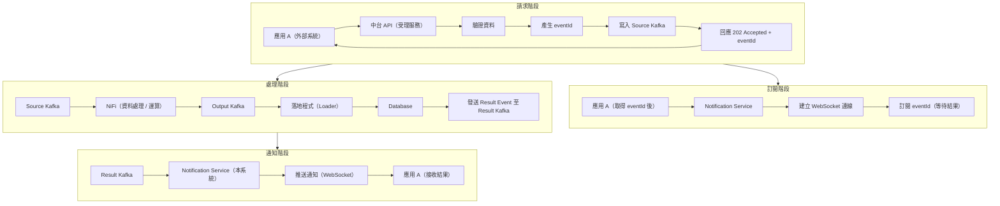
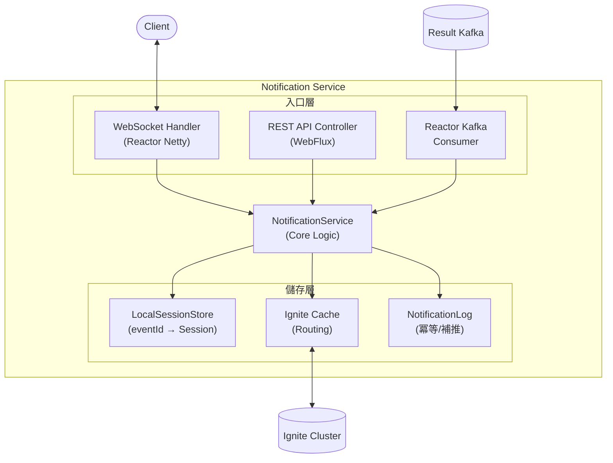
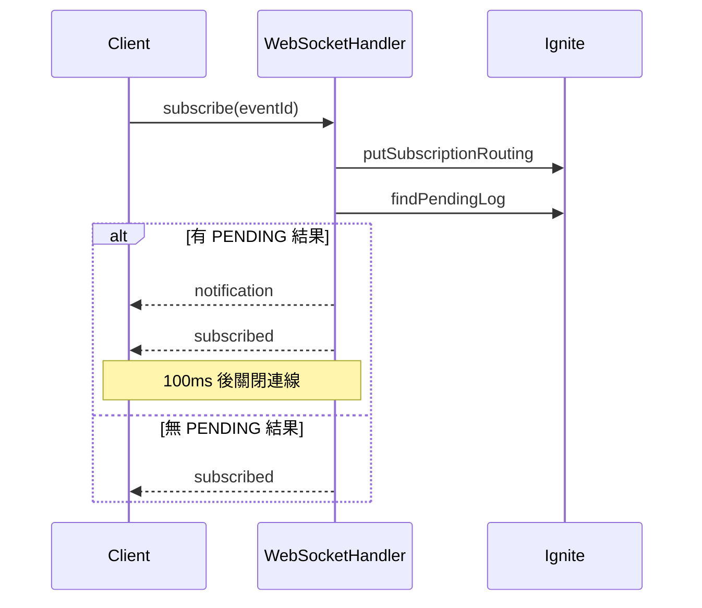
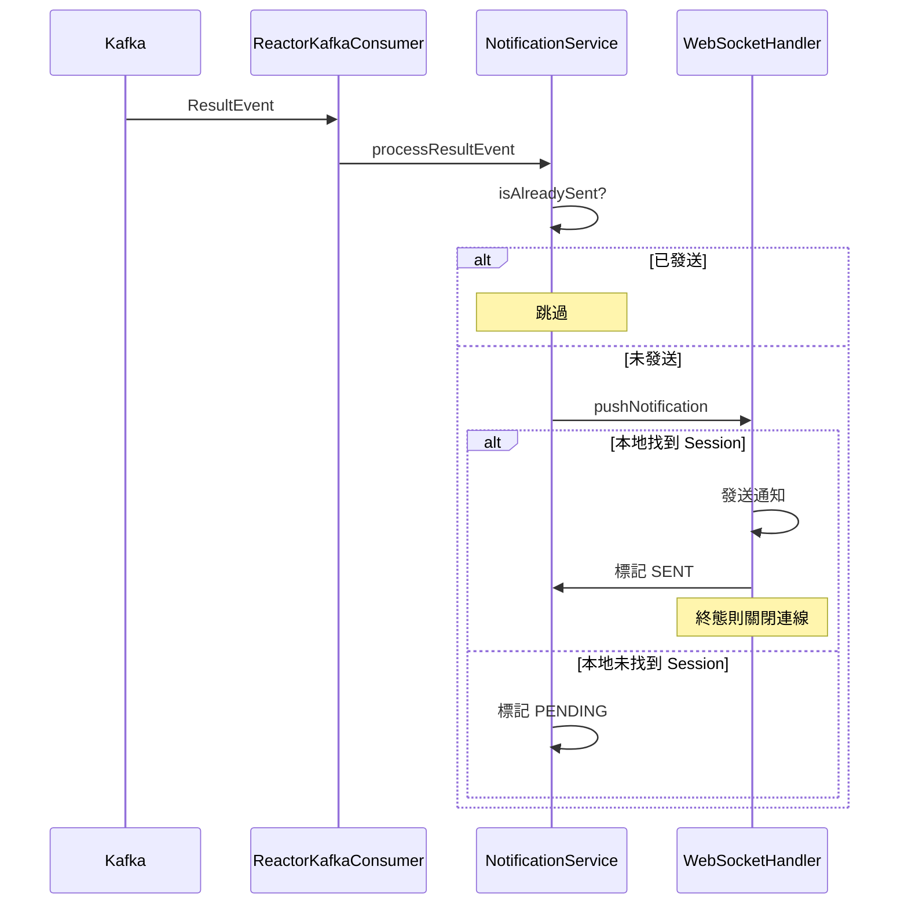

# Notification Service 規格書 v2

## 1. 文件目的

本文件定義「Notification Service（結果通知服務）」規格，用於在事件驅動資料中台架構中，於資料處理完成後，**非同步通知原始請求使用者處理結果（成功 / 失敗）**。

---

## 2. 系統背景與架構

### 2.1 整體流程



### 2.2 核心設計原則

- 請求與結果 **完全非同步**
- 中台透過 **Notification Service** 與應用互動
- 結果本身也是一種「事件」
- 使用 `eventId` 作為端到端追蹤錨點

### 2.3 系統角色定義

| 角色 | 說明 |
|------|------|
| **應用 A** | 外部系統，呼叫中台、訂閱 eventId、接收結果 |
| **中台 API** | 中台入口服務，受理請求、產生 eventId |
| **Notification Service** | 中台結果服務，管理 Subscription、消費 Result Kafka、推送通知 |

---

## 3. 技術選型

### 3.1 技術棧總覽

| 項目 | 選擇 | 版本 | 說明 |
|------|------|------|------|
| 語言 | Java | 21 | LTS 版本，支援 Virtual Threads |
| 框架 | Spring Boot + WebFlux | 3.2.1 | 非同步非阻塞，支援高併發 |
| WebSocket | Reactor Netty | - | WebFlux 原生支援 |
| Kafka Client | Reactor Kafka | 1.3.22 | 與 WebFlux 整合 |
| 分散式狀態儲存 | Apache Ignite | 2.16.0 | 中台已有基礎設施（支援真實/模擬切換） |
| 建置工具 | Maven | - | |

### 3.2 架構圖



### 3.3 Maven 依賴

```xml
<!-- Spring Boot WebFlux -->
<dependency>
    <groupId>org.springframework.boot</groupId>
    <artifactId>spring-boot-starter-webflux</artifactId>
</dependency>

<!-- Reactor Kafka -->
<dependency>
    <groupId>io.projectreactor.kafka</groupId>
    <artifactId>reactor-kafka</artifactId>
    <version>1.3.22</version>
</dependency>

<!-- Apache Ignite -->
<dependency>
    <groupId>org.apache.ignite</groupId>
    <artifactId>ignite-core</artifactId>
    <version>2.16.0</version>
</dependency>
<dependency>
    <groupId>org.apache.ignite</groupId>
    <artifactId>ignite-spring</artifactId>
    <version>2.16.0</version>
</dependency>

<!-- Actuator -->
<dependency>
    <groupId>org.springframework.boot</groupId>
    <artifactId>spring-boot-starter-actuator</artifactId>
</dependency>

<!-- Micrometer Prometheus -->
<dependency>
    <groupId>io.micrometer</groupId>
    <artifactId>micrometer-registry-prometheus</artifactId>
</dependency>

<!-- Lombok -->
<dependency>
    <groupId>org.projectlombok</groupId>
    <artifactId>lombok</artifactId>
</dependency>
```

---

## 4. 服務定位與責任

### 4.1 服務定位

Notification Service 屬於 **中台元件**，責任為：

> **將中台產生的「處理結果事件」，透過 WebSocket 即時推送至訂閱的應用。**

### 4.2 明確責任

#### 必須負責

- 監聽 Result Kafka（`results` topic）
- 解析處理結果事件（ResultEvent）
- 管理 Subscription（eventId → 連線）
- 執行通知派送（WebSocket）
- 確保冪等（透過 eventId 避免重複通知）
- 支援補推機制（Late Subscription）
- 記錄通知結果狀態

#### 明確不負責

- 不重新運算資料
- 不修改業務資料
- 不觸碰 NiFi / Source Kafka / Output Kafka
- 不決定資料成功與否（僅轉述結果）

---

## 5. 資料模型

### 5.1 ResultEvent（Kafka 消息）

從 Kafka 接收的結果事件。

```java
public class ResultEvent {
    String schemaVersion;   // Schema 版本，例如 "1.0"
    String eventId;         // 事件識別碼（唯一，用於冪等）
    int status;             // 業務狀態碼 (1xxx/2xxx/3xxx)
    String message;         // 訊息內容
    Long completedAt;       // 完成時間 (epoch millis)
    String traceId;         // 追蹤 ID
}
```

**JSON 範例：**
```json
{
  "schemaVersion": "1.0",
  "eventId": "evt-12345",
  "status": 1000,
  "message": "處理完成",
  "completedAt": 1736668800000,
  "traceId": "trace-abc123"
}
```

### 5.2 StatusCode（業務狀態碼）

狀態碼分為三大類：

| 範圍 | 類型 | 說明 | 日誌等級 |
|------|------|------|----------|
| 1xxx | 成功 | 處理成功 | INFO |
| 2xxx | 業務錯誤 | 可預期的錯誤 | WARN |
| 3xxx | 系統錯誤 | 非預期的錯誤 | ERROR |

**預定義狀態碼：**

```java
// 1xxx 成功
SUCCESS = 1000;          // 處理完成
QUERY_SUCCESS = 1001;    // 查詢成功
QUERY_NO_DATA = 1002;    // 查詢成功（無資料）

// 2xxx 業務錯誤
BIZ_ERROR = 2000;        // 業務錯誤（通用）
NOT_FOUND = 2001;        // 資料不存在
FORBIDDEN = 2002;        // 權限不足
VALIDATION_ERROR = 2003; // 資料驗證失敗
DUPLICATE = 2004;        // 重複請求

// 3xxx 系統錯誤
SYS_ERROR = 3000;        // 系統錯誤（通用）
TIMEOUT = 3001;          // 處理超時
SERVICE_UNAVAILABLE = 3002; // 服務不可用
RESOURCE_EXHAUSTED = 3003;  // 資源不足
```

**終態判定：**
- 狀態碼 >= 1000 視為終態（任務已完成）
- 終態狀態會觸發 WebSocket 連線關閉

### 5.3 SubscriptionRouting（訂閱路由）

用於 Ignite 跨節點路由。

```java
public class SubscriptionRouting {
    String eventId;           // 事件識別碼
    String nodeId;            // 節點 ID
    String sessionId;         // WebSocket Session ID
    long subscribedAtMillis;  // 訂閱時間 (epoch millis)
}
```

> **注意**：使用 `long` 而非 `Instant`，因為 Ignite Thin Client 序列化不支援 Java 8 時間類型。

### 5.4 NotificationLog（通知日誌）

用於冪等控制和補推。

```java
public class NotificationLog {
    String eventId;           // 事件識別碼
    PushStatus pushStatus;    // 推送狀態
    ResultPayload resultPayload; // 結果載荷（用於補推）
    int attempts;             // 嘗試次數
    long createdAt;           // 建立時間 (epoch millis)
    long updatedAt;           // 更新時間 (epoch millis)
}

enum PushStatus {
    PENDING,  // 結果已到達，等待推送
    SENT,     // 已成功推送
    FAILED    // 重試耗盡仍失敗
}
```

**Ignite Cache Key：** `{keyPrefix}:{eventId}`（例如 `ns:evt-12345`）

### 5.5 ResultPayload（結果載荷）

用於補推時儲存的結果內容。

```java
public class ResultPayload {
    int status;      // 業務狀態碼
    String message;  // 訊息內容
}
```

---

## 6. WebSocket 協議

### 6.1 連線端點

```
ws://localhost:8080/ws/notifications
```

### 6.2 訊息格式

所有訊息皆為 JSON 格式，以 `type` 欄位區分訊息類型。

### 6.3 Client → Server

#### 6.3.1 subscribe（訂閱）

```json
{
  "type": "subscribe",
  "eventId": "evt-12345"
}
```

#### 6.3.2 unsubscribe（取消訂閱）

```json
{
  "type": "unsubscribe",
  "eventId": "evt-12345"
}
```

#### 6.3.3 ping（心跳）

```json
{
  "type": "ping",
  "timestamp": 1736668800000
}
```

### 6.4 Server → Client

#### 6.4.1 subscribed（訂閱確認）

```json
{
  "type": "subscribed",
  "eventId": "evt-12345",
  "timestamp": 1736668800000
}
```

#### 6.4.2 unsubscribed（取消訂閱確認）

```json
{
  "type": "unsubscribed",
  "eventId": "evt-12345",
  "timestamp": 1736668800000
}
```

#### 6.4.3 notification（結果通知）

```json
{
  "type": "notification",
  "eventId": "evt-12345",
  "status": 1000,
  "message": "處理完成",
  "timestamp": 1736668800000
}
```

#### 6.4.4 pong（心跳回應）

```json
{
  "type": "pong",
  "timestamp": 1736668800000
}
```

#### 6.4.5 error（錯誤訊息）

```json
{
  "type": "error",
  "code": "INVALID_EVENT_ID",
  "message": "eventId is required",
  "eventId": null,
  "timestamp": 1736668800000
}
```

**錯誤碼定義：**

| 錯誤碼 | 說明 |
|--------|------|
| `INVALID_EVENT_ID` | eventId 無效或缺失 |
| `SUBSCRIPTION_LIMIT_EXCEEDED` | 訂閱數量超過限制 |
| `UNAUTHORIZED` | 未授權 |
| `INTERNAL_ERROR` | 內部錯誤 |

### 6.5 連線行為

1. **連線上限**：單一服務實例最多 10,000 連線（可設定）
2. **終態關閉**：收到終態狀態（status >= 1000）後，服務端會在 100ms 後主動關閉連線
3. **補推機制**：若訂閱時已有 PENDING 結果，會立即推送

---

## 7. REST API

### 7.1 健康檢查

#### GET /api/health（Liveness）

```json
{
  "status": "UP",
  "timestamp": 1736668800000
}
```

#### GET /api/ready（Readiness）

```json
{
  "status": "UP",
  "components": {
    "kafka": "UP",
    "ignite": "UP",
    "websocket": "UP"
  },
  "timestamp": 1736668800000
}
```

### 7.2 服務狀態

#### GET /api/status

```json
{
  "service": "Notification Service",
  "nodeId": "uuid-xxx",
  "kafkaConsumer": "RUNNING",
  "igniteCache": "CONNECTED",
  "websocketConnections": 100,
  "activeSubscriptions": 50,
  "timestamp": 1736668800000
}
```

### 7.3 自訂指標

#### GET /api/metrics/custom

```json
{
  "websocket_connections_total": 100,
  "websocket_subscriptions_total": 50,
  "ignite_subscriptions_total": 50,
  "ignite_subscriptions_by_node": {
    "node-1": 25,
    "node-2": 25
  },
  "ignite_subscriptions_slow": 5,
  "notifications_sent": 1000,
  "notifications_pending": 10,
  "notifications_failed": 2,
  "node_id": "uuid-xxx",
  "timestamp": 1736668800000
}
```

### 7.4 模擬 API（僅開發模式）

> **注意**：僅當 `app.kafka.enabled=false` 時可用

#### POST /api/simulate/success/{eventId}

模擬成功結果。

**參數：**
- `message`（可選）：訊息內容，預設 "處理完成"

**回應：**
```json
{
  "eventId": "evt-12345",
  "status": 1000,
  "message": "處理完成",
  "timestamp": 1736668800000
}
```

#### POST /api/simulate/failed/{eventId}

模擬失敗結果。

**參數：**
- `status`（可選）：狀態碼，預設 3001
- `message`（可選）：訊息內容，預設 "處理超時"

**回應：**
```json
{
  "eventId": "evt-12345",
  "status": 3001,
  "message": "處理超時",
  "timestamp": 1736668800000
}
```

#### POST /api/simulate/delayed/{eventId}

模擬延遲結果。

**參數：**
- `delaySeconds`（可選）：延遲秒數，預設 3

**回應：**
```json
{
  "eventId": "evt-12345",
  "delaySeconds": 3,
  "timestamp": 1736668800000
}
```

### 7.5 Actuator 端點

| 端點 | 說明 |
|------|------|
| GET /actuator/health | Spring Boot 健康檢查 |
| GET /actuator/prometheus | Prometheus 指標 |

---

## 8. 核心處理流程

### 8.1 訂閱流程



### 8.2 通知流程（Kafka → Client）



### 8.3 冪等處理

- **冪等鍵**：`{keyPrefix}:{eventId}`（例如 `ns:evt-12345`）
- **檢查時機**：處理 ResultEvent 前
- **處理邏輯**：若已標記為 SENT，則跳過不重複推送
- **設計考量**：由於終態會關閉 WebSocket 連線，每個 eventId 只會有一次結果，因此不需要額外的 historyId

### 8.4 補推機制（Late Subscription）

當客戶端訂閱時，若結果已經到達（標記為 PENDING）：

1. 立即推送 notification
2. 標記為 SENT
3. 發送 subscribed 確認
4. 若為終態，100ms 後關閉連線

### 8.5 重試機制

- **最大重試次數**：3 次（可設定）
- **重試間隔**：1000ms（可設定）
- **重試策略**：Exponential backoff（Reactor Retry）
- **失敗處理**：重試耗盡後標記為 FAILED

---

## 9. 狀態儲存

### 9.1 Ignite Cache

系統支援兩種 Ignite 實作模式，透過 `app.ignite.enabled` 設定切換：

| 模式 | 設定值 | 實作類別 | 說明 |
|------|--------|----------|------|
| 真實模式 | `true` | `RealIgniteCacheService` | 使用 Ignite Thin Client 連接叢集 |
| 模擬模式 | `false` | `SimulatedIgniteCache` | 使用 ConcurrentHashMap（開發/測試用） |

兩者皆實作 `IgniteCacheService` 介面，Spring 會根據設定自動選擇。

#### 9.1.1 Subscription Routing Cache

- **用途**：儲存 eventId → SubscriptionRouting 映射
- **TTL**：30 分鐘
- **操作**：
  - `putSubscriptionRouting(eventId, routing)`
  - `getSubscriptionRouting(eventId)`
  - `removeSubscriptionRouting(eventId)`

#### 9.1.2 Notification Log Cache

- **用途**：儲存通知日誌用於冪等和補推
- **TTL**：10 分鐘（600 秒）
- **Key 格式**：`{keyPrefix}:{eventId}`（keyPrefix 由設定檔決定，預設 `ns`）
- **操作**：
  - `isAlreadySent(eventId)`
  - `markSent(eventId)`
  - `markPending(eventId, payload)`
  - `markFailed(eventId)`
  - `findPendingLog(eventId)`
  - `getNotificationLog(eventId)`

#### 9.1.3 TTL 清理

每 1 分鐘執行一次過期清理。

### 9.2 LocalSessionStore

本地記憶體儲存 WebSocket Session。

```java
// eventId → WebSocket Session
ConcurrentHashMap<String, WebSocketSession> eventIdToSession;

// Session ID → subscribed eventIds
ConcurrentHashMap<String, Set<String>> sessionToEventIds;

// Session ID → WebSocketSession
ConcurrentHashMap<String, WebSocketSession> sessions;
```

**操作：**
- `registerSession(session)`
- `subscribe(eventId, session)`
- `unsubscribe(eventId, session)`
- `getSessionByEventId(eventId)`
- `removeSession(session)`
- `getConnectionCount()`
- `getSubscriptionCount()`

---

## 10. 組態設定

### 10.1 Server 設定

```properties
server.port=8080
spring.application.name=notification-service
```

### 10.2 Kafka 設定

```properties
spring.kafka.bootstrap-servers=skafka:9092
spring.kafka.consumer.group-id=notification-service
spring.kafka.consumer.auto-offset-reset=earliest
spring.kafka.consumer.enable-auto-commit=false

app.kafka.topic.notification-result=results
app.kafka.enabled=true  # true=真實 Kafka, false=模擬
```

### 10.3 Ignite 設定

```properties
# 啟用真實 Ignite（連接叢集）
app.ignite.enabled=true
# 使用模擬實作（開發/測試）
# app.ignite.enabled=false

app.ignite.addresses=localhost:10800
app.ignite.cluster-name=osw-cluster

# Key prefix for Notification Log cache (用於區分環境或服務)
app.ignite.key-prefix=ns

# Subscription Routing Cache
app.ignite.cache.subscription-routing.name=subscription-routing-v2
app.ignite.cache.subscription-routing.backups=1
app.ignite.cache.subscription-routing.expiry-seconds=300

# Notification Log Cache
app.ignite.cache.notification-log.name=notification-logs
app.ignite.cache.notification-log.backups=1
app.ignite.cache.notification-log.expiry-seconds=600

# Cross-node messaging
app.ignite.messaging.topic=ns-notifications
```

### 10.4 WebSocket 設定

```properties
app.websocket.path=/ws/notifications
app.websocket.max-connections=10000
app.websocket.idle-timeout-seconds=60
```

### 10.5 業務邏輯設定

```properties
app.subscription.timeout-seconds=30
app.notification.max-retries=3
app.notification.retry-delay-ms=1000
```

### 10.6 Actuator 設定

```properties
management.endpoints.web.exposure.include=health,ready,metrics,prometheus
management.endpoint.health.show-details=when_authorized
management.health.kafka.enabled=true
```

### 10.7 日誌設定

```properties
logging.level.root=INFO
logging.level.com.osw.dmp.ns=DEBUG
logging.level.org.apache.kafka=WARN
logging.level.org.apache.ignite=WARN
```

### 10.8 Virtual Threads

```properties
spring.threads.virtual.enabled=true
```

---

## 11. 健康指標

### 11.1 Custom Health Indicators

系統實作三個自訂健康指標：

| 指標 | 類別 | 檢查內容 |
|------|------|----------|
| KafkaHealthIndicator | Kafka | Consumer 是否運行 |
| IgniteHealthIndicator | Ignite | Cache 是否連線 |
| WebSocketHealthIndicator | WebSocket | 連線數、訂閱數、nodeId |

### 11.2 Readiness 判定

所有組件 UP 才視為 Ready：
- Kafka Consumer running
- Ignite Cache connected
- WebSocket always UP

---

## 12. 程式碼結構

```
src/main/java/com/osw/dmp/ns/
├── NotificationServiceApplication.java    # 主程式入口
├── config/
│   ├── IgniteConfig.java                  # Ignite 設定屬性
│   ├── JacksonConfig.java                 # Jackson 設定
│   ├── KafkaConfig.java                   # Kafka 設定
│   └── WebSocketConfig.java               # WebSocket 設定
├── controller/
│   └── NotificationController.java        # REST API
├── health/
│   └── HealthIndicators.java              # 健康檢查指標
├── ignite/
│   ├── IgniteCacheService.java            # Ignite Cache 介面
│   ├── RealIgniteCacheService.java        # 真實 Ignite Thin Client 實作
│   └── SimulatedIgniteCache.java          # Ignite 模擬實作（開發用）
├── kafka/
│   ├── KafkaConsumerStatus.java           # Consumer 狀態介面
│   ├── ReactorKafkaConsumer.java          # 真實 Kafka Consumer
│   └── SimulatedKafkaConsumer.java        # 模擬 Kafka Consumer
├── model/
│   ├── NotificationLog.java               # 通知日誌
│   ├── ResultEvent.java                   # Kafka 結果事件
│   ├── ResultPayload.java                 # 結果載荷
│   ├── StatusCode.java                    # 狀態碼定義
│   └── SubscriptionRouting.java           # 訂閱路由
├── service/
│   └── NotificationService.java           # 核心業務邏輯
└── websocket/
    ├── LocalSessionStore.java             # 本地 Session 儲存
    ├── NotificationWebSocketHandler.java  # WebSocket 處理器
    └── WebSocketMessages.java             # WebSocket 訊息定義
```

---

## 13. 啟動說明

### 13.1 開發模式（模擬 Kafka + 模擬 Ignite）

```bash
# application.properties
app.kafka.enabled=false
app.ignite.enabled=false

# 啟動
mvn spring-boot:run
```

### 13.2 開發模式（模擬 Kafka + 真實 Ignite）

```bash
# 確保 Ignite Server 已啟動在 localhost:10800
# application.properties
app.kafka.enabled=false
app.ignite.enabled=true

# 啟動
mvn spring-boot:run
```

啟動後會顯示：
```
═══════════════════════════════════════════════════════════════
   🚀 Notification Service Started!
═══════════════════════════════════════════════════════════════

   📡 WebSocket Endpoint: ws://localhost:8080/ws/notifications
   📡 Kafka Enabled: false

   🔧 Simulation APIs:
      POST /api/simulate/success/{eventId}  - Simulate success
      POST /api/simulate/failed/{eventId}   - Simulate failure
      POST /api/simulate/delayed/{eventId}  - Simulate delayed

   📊 Status APIs:
      GET  /api/status                      - Service status
      GET  /api/health                      - Health check
      GET  /api/ready                       - Readiness check
      GET  /api/metrics/custom              - Custom metrics

   📈 Actuator:
      GET  /actuator/health                 - Spring Health
      GET  /actuator/prometheus             - Prometheus metrics

═══════════════════════════════════════════════════════════════
```

### 13.3 生產模式（真實 Kafka + 真實 Ignite）

```bash
# application.properties
app.kafka.enabled=true
app.ignite.enabled=true
spring.kafka.bootstrap-servers=kafka:9092
app.ignite.addresses=ignite-server:10800

# 啟動
mvn spring-boot:run
```

---

## 14. 測試流程範例

### 14.1 基本訂閱與通知

1. **建立 WebSocket 連線**
   ```
   wscat -c ws://localhost:8080/ws/notifications
   ```

2. **訂閱 eventId**
   ```json
   {"type":"subscribe","eventId":"test-001"}
   ```

3. **收到訂閱確認**
   ```json
   {"type":"subscribed","eventId":"test-001","timestamp":1736668800000}
   ```

4. **模擬發送結果（另一個終端）**
   ```bash
   curl -X POST http://localhost:8080/api/simulate/success/test-001
   ```

5. **收到通知後連線關閉**
   ```json
   {"type":"notification","eventId":"test-001","status":1000,"message":"處理完成","timestamp":1736668800000}
   ```

### 14.2 補推測試（Late Subscription）

1. **先模擬發送結果**
   ```bash
   curl -X POST http://localhost:8080/api/simulate/success/late-001
   ```

2. **之後建立連線並訂閱**
   ```json
   {"type":"subscribe","eventId":"late-001"}
   ```

3. **立即收到之前的結果**
   ```json
   {"type":"notification","eventId":"late-001","status":1000,"message":"處理完成","timestamp":...}
   {"type":"subscribed","eventId":"late-001","timestamp":...}
   ```

---

## 15. 注意事項

1. **終態關閉**：收到終態狀態（status >= 1000）後，服務端會主動關閉 WebSocket 連線
2. **冪等保證**：同一 eventId 只會推送一次
3. **補推機制**：訂閱時若有 PENDING 結果會立即推送
4. **Ignite 切換**：透過 `app.ignite.enabled` 切換真實/模擬模式
5. **外部設定覆蓋**：JAR 同層的 `application.properties` 會覆蓋 JAR 內的預設值
   - `true`：使用 Ignite Thin Client 連接 `app.ignite.addresses` 指定的叢集
   - `false`：使用 ConcurrentHashMap 模擬（僅限單節點開發/測試）
5. **跨節點推送**：啟用真實 Ignite 後支援跨節點狀態共享，跨節點訊息推送機制待實作
